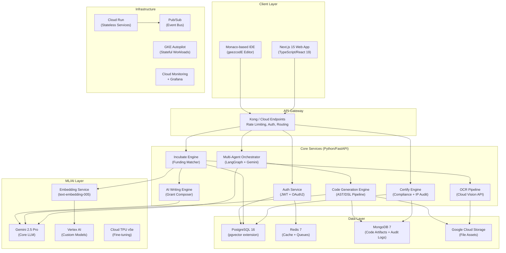
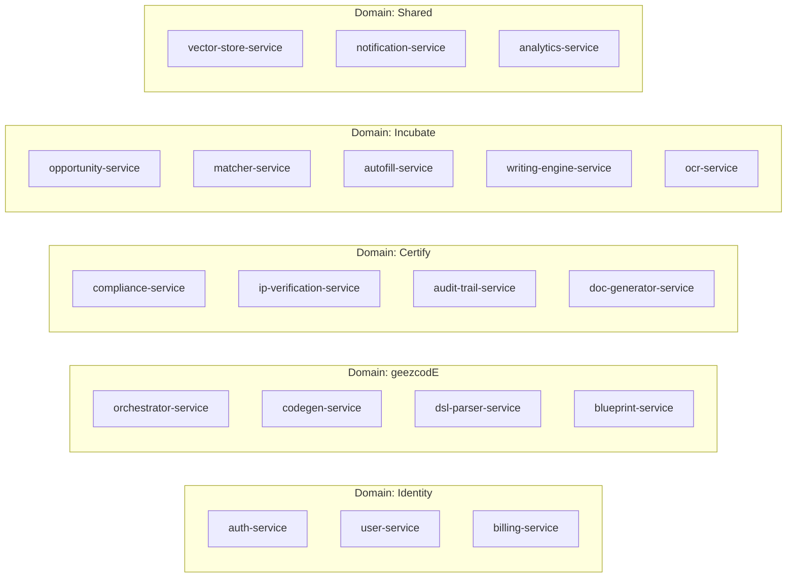
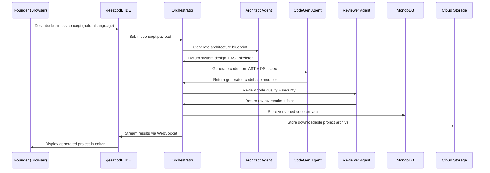
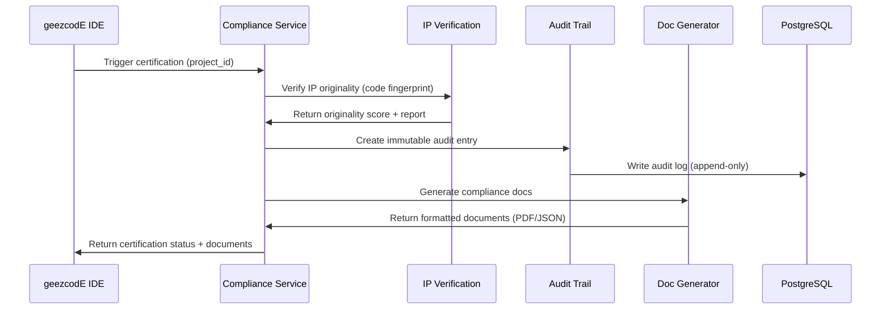
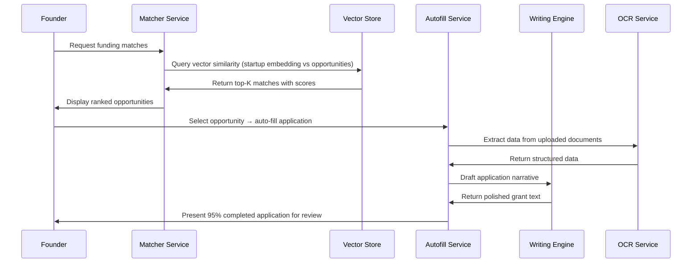
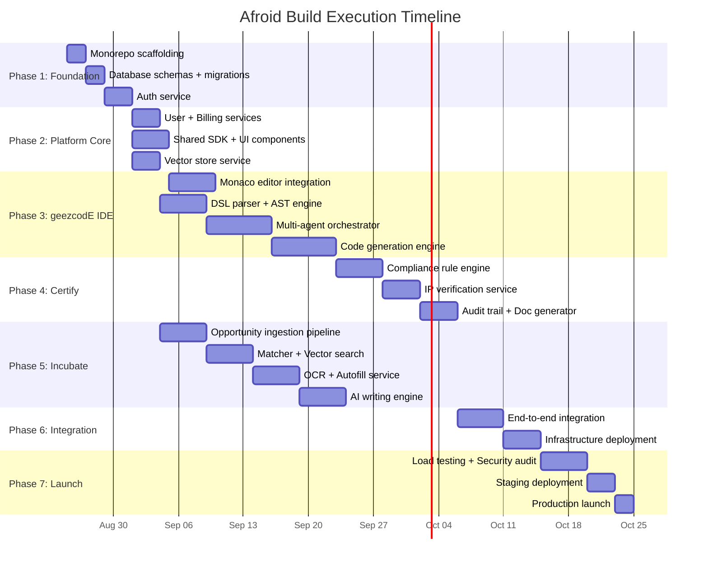

# Afroid: Sovereign Autonomous Startup Factory — Master Architecture Blueprint

> **Document Type**: Executable Architectural Blueprint  
> **Version**: 1.0.0  
> **Status**: Ready for Execution  
> **Target Executor**: Any frontier AI model or senior engineering team  

---

## Table of Contents

1. [System Overview](#1-system-overview)
2. [High-Level Architecture](#2-high-level-architecture)
3. [Service Boundary Map](#3-service-boundary-map)
4. [Data Flow Architecture](#4-data-flow-architecture)
5. [Blueprint Index](#5-blueprint-index)
6. [Execution Order](#6-execution-order)
7. [Non-Negotiable Constraints](#7-non-negotiable-constraints)

---

## 1. System Overview

Afroid is composed of **three primary systems** and **one shared infrastructure layer**:

| System | Codename | Role |
|--------|----------|------|
| **geezcodE IDE** | `geezcode` | Deep-tech web IDE — transforms business concepts into production-ready codebases via multi-agent AI orchestration |
| **Afroid Certify** | `certify` | RegTech compliance engine — audits code/IP, generates Startup Act documentation, maintains immutable audit trails |
| **Afroid Incubate** | `incubate` | Non-dilutive funding pipeline — matches startups to $3B+ opportunities via vector search, auto-populates 95% of applications |
| **Shared Platform** | `platform` | Auth, billing, user management, shared APIs, vector store, infrastructure |

---

## 2. High-Level Architecture

---

## 3. Service Boundary Map

Each service is an **independently deployable container** communicating via REST APIs and Pub/Sub events.

### Inter-Service Communication

| Pattern | Use Case | Technology |
|---------|----------|------------|
| **Synchronous REST** | User-facing CRUD, real-time queries | FastAPI → HTTP/JSON |
| **Async Events** | Code generation completion, audit triggers, funding matches | Google Pub/Sub |
| **WebSocket** | IDE real-time updates, live code generation streaming | Socket.IO over Cloud Run |
| **gRPC (internal)** | High-throughput vector lookups, embedding requests | gRPC + Protobuf |

---

## 4. Data Flow Architecture

### Flow 1: Idea → Production Code (geezcodE)

### Flow 2: Code → Certification (Certify)

### Flow 3: Profile → Funding Match (Incubate)

---

## 5. Blueprint Index

Each blueprint below is a **self-contained, executable specification**. They must be read and executed in the order specified in Section 6.

| # | Blueprint File | Description |
|---|----------------|-------------|
| 00 | [`00-EXECUTION-PLAYBOOK.md`](./blueprints/00-EXECUTION-PLAYBOOK.md) | Step-by-step build phases with exact commands and acceptance criteria |
| 01 | [`01-PROJECT-STRUCTURE.md`](./blueprints/01-PROJECT-STRUCTURE.md) | Complete directory tree with every file path and purpose |
| 02 | [`02-TECH-STACK.md`](./blueprints/02-TECH-STACK.md) | Every technology, version, and justification |
| 03 | [`03-GEEZCODE-IDE.md`](./blueprints/03-GEEZCODE-IDE.md) | IDE architecture: Monaco, real-time collaboration, file system |
| 04 | [`04-MULTI-AGENT-SYSTEM.md`](./blueprints/04-MULTI-AGENT-SYSTEM.md) | Agent definitions, orchestration graph, prompt chains |
| 05 | [`05-AFROID-CERTIFY.md`](./blueprints/05-AFROID-CERTIFY.md) | Compliance engine, IP verification, audit trail, doc generation |
| 06 | [`06-AFROID-INCUBATE.md`](./blueprints/06-AFROID-INCUBATE.md) | Vector matching, OCR pipeline, AI writer, auto-population |
| 07 | [`07-DATA-MODELS.md`](./blueprints/07-DATA-MODELS.md) | All database schemas: PostgreSQL, MongoDB, Redis, Vector Store |
| 08 | [`08-API-CONTRACTS.md`](./blueprints/08-API-CONTRACTS.md) | Every REST endpoint, WebSocket event, and gRPC service definition |
| 09 | [`09-INFRASTRUCTURE.md`](./blueprints/09-INFRASTRUCTURE.md) | GCP Terraform modules, Cloud Run configs, TPU allocation |
| 10 | [`10-SECURITY-AUTH.md`](./blueprints/10-SECURITY-AUTH.md) | Authentication, authorization, data encryption, RBAC |
| 11 | [`11-CI-CD-PIPELINE.md`](./blueprints/11-CI-CD-PIPELINE.md) | GitHub Actions, Cloud Build, testing, deployment pipelines |

---

## 6. Execution Order

> **CRITICAL**: Build phases must be executed sequentially. Each phase depends on artifacts from the previous phase.

---

## 7. Non-Negotiable Constraints

These constraints are **absolute** and must be enforced across every blueprint:

### Architecture Constraints
- **Monorepo**: All code lives in a single repository managed by Turborepo (TS) and uv workspaces (Python)
- **Container-First**: Every service must be deployable as a Docker container
- **Stateless Services**: All services on Cloud Run must be stateless; state lives in databases
- **Event-Driven**: Cross-service communication uses Pub/Sub for async operations

### Technology Constraints
- **Frontend**: TypeScript 5.5+, React 19, Next.js 15 (App Router), NO Pages Router
- **Backend**: Python 3.12+, FastAPI 0.115+, Pydantic v2 for all data validation
- **LLM**: Google Gemini 2.5 Pro via Vertex AI SDK (NOT direct API keys in production)
- **Database**: PostgreSQL 16 with pgvector 0.7+, MongoDB 7, Redis 7
- **IaC**: Terraform 1.9+ with Google provider, NO ClickOps

### Security Constraints
- **Zero Trust**: All inter-service calls authenticated via service accounts
- **Encryption**: TLS 1.3 in transit, AES-256 at rest, CMEK for sensitive data
- **Data Residency**: All production data hosted in `africa-south1` (Johannesburg)
- **RBAC**: Role-based access control on every endpoint
- **Audit Logging**: Every state mutation logged to immutable audit trail

### Code Quality Constraints
- **Type Safety**: 100% type coverage in TypeScript; strict mypy in Python
- **Testing**: Minimum 80% code coverage; unit + integration + e2e tests
- **Linting**: ESLint + Prettier (TS), Ruff + Black (Python)
- **Documentation**: Every public API must have OpenAPI spec; every module must have docstrings
- **Git**: Conventional Commits, trunk-based development, PR reviews required

---

> **Next Step**: Begin execution by reading [`blueprints/00-EXECUTION-PLAYBOOK.md`](./blueprints/00-EXECUTION-PLAYBOOK.md)
