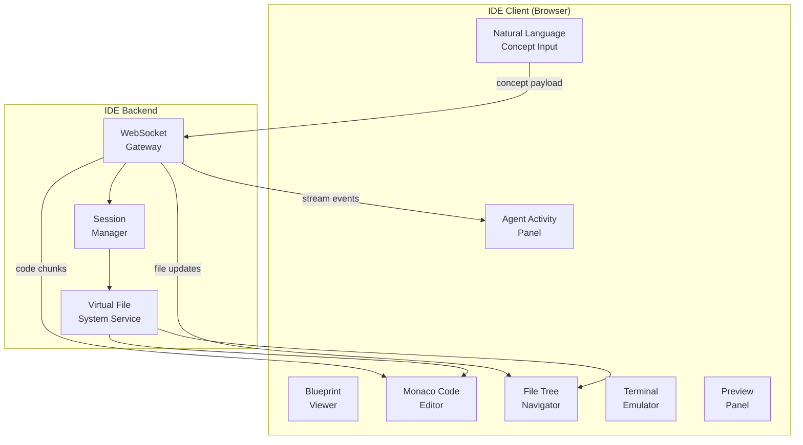
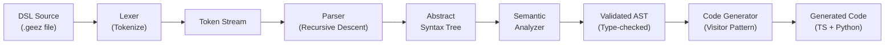
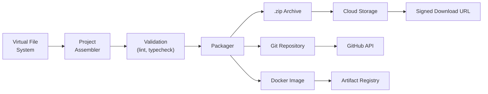

# Blueprint 03: geezcodE IDE Architecture

> **Purpose**: Complete architecture for the web-based IDE — Monaco editor, file system, real-time streaming, and concept-to-code pipeline.  
> **Dependencies**: Blueprint 01 (structure), Blueprint 02 (tech stack)

---

## 1. IDE Overview

The geezcodE IDE is a **browser-based integrated development environment** that serves as the "Architect Intake" for the Afroid factory. It enables founders to:

1. Describe business concepts in natural language
2. Watch AI agents transform concepts into architecture blueprints
3. See production-ready code generated in real-time
4. Edit, refine, and download the generated codebase
5. Trigger certification and funding matching from within the IDE



---

## 2. IDE Layout Specification

### 2.1 Layout Grid

```
┌──────────────────────────────────────────────────────────────────┐
│  Top Bar: Logo | Project Name | Save | Run | Certify | Incubate │
├──────────┬───────────────────────────────┬───────────────────────┤
│          │                               │                       │
│  File    │    Monaco Editor              │  Right Panel           │
│  Tree    │    (Multi-tab, Split view)    │  (Context-dependent)   │
│          │                               │  - Agent Activity      │
│  240px   │    flex: 1                    │  - Blueprint Viewer    │
│  min     │                               │  - Preview             │
│          │                               │  320px min             │
│          │                               │                       │
├──────────┴───────────────────────────────┴───────────────────────┤
│  Bottom Panel (collapsible):                                     │
│  - Concept Input | Terminal | Output | Problems                  │
│  200px default height                                            │
└──────────────────────────────────────────────────────────────────┘
```

### 2.2 Panel States

| Panel | Default State | Content |
|-------|---------------|---------|
| File Tree | Expanded (240px) | Virtual file system tree |
| Editor | Active | Monaco editor with syntax highlighting |
| Right Panel | Agent Activity | Real-time agent thoughts and actions |
| Bottom Panel | Concept Input | Natural language input area |
| Terminal | Hidden tab | Xterm.js terminal emulator |
| Preview | Hidden tab | iframe preview of generated web app |

### 2.3 Resizable Panels

All panel dividers are **draggable** with these constraints:
- File tree: min 180px, max 400px
- Right panel: min 280px, max 600px
- Bottom panel: min 120px, max 50% viewport height
- All panels can be collapsed to 0 (icon-only mode)

---

## 3. Monaco Editor Configuration

### 3.1 Editor Setup

```typescript
// MonacoEditor.tsx - Core configuration
const editorConfig: monaco.editor.IStandaloneEditorConstructionOptions = {
  theme: 'afroid-dark', // Custom theme
  fontSize: 14,
  fontFamily: "'JetBrains Mono', 'Fira Code', monospace",
  fontLigatures: true,
  minimap: { enabled: true, scale: 2 },
  lineNumbers: 'on',
  renderWhitespace: 'selection',
  bracketPairColorization: { enabled: true },
  autoIndent: 'full',
  formatOnPaste: true,
  formatOnType: true,
  suggestOnTriggerCharacters: true,
  tabSize: 2,
  wordWrap: 'on',
  scrollBeyondLastLine: false,
  automaticLayout: true,
  // AI code completion
  inlineSuggest: { enabled: true },
};
```

### 3.2 Custom Theme

```typescript
// afroid-dark theme definition
monaco.editor.defineTheme('afroid-dark', {
  base: 'vs-dark',
  inherit: true,
  rules: [
    { token: 'comment', foreground: '6A737D', fontStyle: 'italic' },
    { token: 'keyword', foreground: 'FF79C6' },
    { token: 'string', foreground: 'F1FA8C' },
    { token: 'number', foreground: 'BD93F9' },
    { token: 'type', foreground: '8BE9FD' },
    { token: 'function', foreground: '50FA7B' },
    { token: 'variable', foreground: 'F8F8F2' },
    { token: 'operator', foreground: 'FF79C6' },
  ],
  colors: {
    'editor.background': '#0D1117',
    'editor.foreground': '#C9D1D9',
    'editorLineNumber.foreground': '#484F58',
    'editorCursor.foreground': '#F0B429', // Gold cursor
    'editor.selectionBackground': '#264F78',
    'editor.lineHighlightBackground': '#161B22',
    'editorSuggestWidget.background': '#1C2128',
  },
});
```

### 3.3 Language Support

Register these languages for syntax highlighting:
- TypeScript / JavaScript / JSX / TSX
- Python
- JSON / YAML / TOML
- Markdown
- HTML / CSS / SCSS
- SQL
- Dockerfile
- Shell / Bash
- **geezcodE DSL** (custom language — see Section 6)

### 3.4 Multi-Tab System

```typescript
interface EditorTab {
  id: string;                    // Unique tab ID
  filePath: string;              // Virtual file path
  language: string;              // Language ID
  content: string;               // Current content
  originalContent: string;       // Content at last save (for diff)
  isDirty: boolean;              // Has unsaved changes
  isGenerated: boolean;          // Was AI-generated
  cursorPosition: {              // Cursor state
    lineNumber: number;
    column: number;
  };
  scrollPosition: {              // Scroll state
    scrollTop: number;
    scrollLeft: number;
  };
}
```

---

## 4. Virtual File System

The IDE operates on an **in-memory virtual file system** (VFS) that mirrors a real project structure. The VFS is synced to MongoDB for persistence.

### 4.1 VFS Data Structure

```typescript
// virtualFs.ts
interface VFSNode {
  id: string;                     // UUID
  name: string;                   // File or directory name
  path: string;                   // Full path from root
  type: 'file' | 'directory';
  children?: VFSNode[];           // Only for directories
  content?: string;               // Only for files
  language?: string;              // Detected language
  size: number;                   // Content length in bytes
  metadata: {
    createdAt: string;            // ISO timestamp
    updatedAt: string;
    createdBy: 'user' | 'agent';  // Who created this file
    agentName?: string;           // Which agent (if agent-created)
    generationId?: string;        // Links to generation session
    version: number;              // Incremental version
  };
}
```

### 4.2 VFS Operations

```typescript
interface VirtualFileSystem {
  // File operations
  createFile(path: string, content: string, metadata?: Partial<VFSMetadata>): VFSNode;
  readFile(path: string): string;
  updateFile(path: string, content: string): VFSNode;
  deleteFile(path: string): void;
  renameFile(oldPath: string, newPath: string): VFSNode;

  // Directory operations
  createDirectory(path: string): VFSNode;
  listDirectory(path: string): VFSNode[];
  deleteDirectory(path: string, recursive?: boolean): void;

  // Search
  findFiles(pattern: string): VFSNode[];   // Glob pattern matching
  searchContent(query: string): SearchResult[];

  // Serialization
  toJSON(): SerializedVFS;
  fromJSON(data: SerializedVFS): void;
  toZip(): Promise<Blob>;                  // Export as downloadable zip

  // Diff
  getDiff(path: string): FileDiff;         // Get changes since last save
  getProjectDiff(): ProjectDiff;           // All unsaved changes
}
```

### 4.3 VFS Persistence

```
Browser (Zustand Store)
    ↕ WebSocket sync
Backend (Session Manager)
    ↕ Periodic snapshots
MongoDB (code_artifacts collection)
    ↕ On-demand archive
Google Cloud Storage (.zip archives)
```

---

## 5. Concept Input System

### 5.1 Input Interface

The Concept Input panel at the bottom of the IDE is the primary entry point for "vibe-coding."

```typescript
interface ConceptInputState {
  mode: 'chat' | 'structured';    // Free-form vs guided input
  messages: ConceptMessage[];      // Chat history with AI
  currentDraft: string;            // Current input text
  attachments: Attachment[];       // Uploaded files, screenshots
  context: {
    selectedFiles: string[];       // Files selected as context
    selectedCode: string;          // Code selection from editor
    projectMetadata: ProjectMeta;  // Auto-included project context
  };
}

interface ConceptMessage {
  id: string;
  role: 'user' | 'assistant' | 'system';
  content: string;
  timestamp: string;
  agentName?: string;              // Which agent responded
  artifacts?: MessageArtifact[];   // Generated files, blueprints
}
```

### 5.2 Structured Input Mode

For guided project creation, the structured mode presents a wizard:

```
Step 1: Business Domain
  - Industry sector (dropdown)
  - Problem statement (textarea)
  - Target market (multi-select: Nigeria, Kenya, South Africa, Ethiopia, Pan-African, Global)

Step 2: Technical Requirements
  - Application type (Web App, Mobile App, API, CLI, Platform)
  - Frontend framework preference (React, Next.js, Vue, Angular, None)
  - Backend framework preference (FastAPI, Django, Express, NestJS, None)
  - Database needs (Relational, Document, Graph, Vector, Time-series)
  - Authentication (Email/Password, OAuth, SSO, API Keys)

Step 3: Scale & Constraints
  - Expected users (< 1K, 1K-10K, 10K-100K, 100K+)
  - Compute requirements (Low, Medium, High, GPU-intensive)
  - Compliance requirements (checkboxes for each Startup Act)
  - Budget tier (Bootstrap, Seed, Series A+)

Step 4: Additional Context
  - Existing documentation upload (PDF, DOCX)
  - Competitor references (URLs)
  - Design preferences (upload mockups)
  - Custom instructions (textarea)
```

### 5.3 Concept-to-Orchestration Payload

The concept input is transformed into a structured orchestration request:

```typescript
interface OrchestrationRequest {
  projectId: string;
  sessionId: string;
  concept: {
    description: string;          // Natural language description
    domain: string;               // Business domain
    targetMarket: string[];       // Geographic targets
    applicationType: string;
    techPreferences: {
      frontend?: string;
      backend?: string;
      database?: string[];
      auth?: string[];
    };
    scale: {
      expectedUsers: string;
      computeNeeds: string;
    };
    compliance: string[];         // Required Startup Act compliance
  };
  context: {
    existingFiles?: VFSNode[];    // If iterating on existing project
    selectedCode?: string;
    attachments?: Attachment[];
    conversationHistory?: ConceptMessage[];
  };
  settings: {
    generateTests: boolean;
    generateDocs: boolean;
    generateDocker: boolean;
    generateCI: boolean;
    codeStyle: 'clean' | 'verbose' | 'production';
  };
}
```

---

## 6. geezcodE DSL Specification

The DSL is a high-level domain-specific language that allows founders to define business logic in a semi-structured format between natural language and code.

### 6.1 Grammar Definition (EBNF)

```ebnf
program        = { statement } ;
statement      = domain_def | entity_def | flow_def | rule_def | api_def | import_stmt ;

domain_def     = "domain" IDENTIFIER "{" { domain_body } "}" ;
domain_body    = description | entity_ref | flow_ref ;
description    = "describe" STRING ;

entity_def     = "entity" IDENTIFIER "{" { field_def } "}" ;
field_def      = IDENTIFIER ":" type_expr [ constraint ] ";" ;
type_expr      = "string" | "number" | "boolean" | "date" | "money"
               | "email" | "phone" | "url" | "file"
               | IDENTIFIER                          (* reference to another entity *)
               | type_expr "[]"                      (* array of type *)
               | type_expr "?"                       (* optional type *)
               ;
constraint     = "@" constraint_name [ "(" constraint_args ")" ] ;
constraint_name = "unique" | "required" | "min" | "max" | "pattern" | "default" ;

flow_def       = "flow" IDENTIFIER "{" { flow_step } "}" ;
flow_step      = "step" IDENTIFIER "{" step_body "}" ;
step_body      = "action" STRING
               | "input" IDENTIFIER
               | "output" IDENTIFIER
               | "condition" STRING
               | "on_error" STRING
               ;

rule_def       = "rule" IDENTIFIER "when" condition "then" action ;
condition      = expression ;
action         = expression ;

api_def        = "api" IDENTIFIER "{" { endpoint_def } "}" ;
endpoint_def   = HTTP_METHOD STRING "->" IDENTIFIER [ "auth" auth_level ] ;
HTTP_METHOD    = "GET" | "POST" | "PUT" | "DELETE" | "PATCH" ;
auth_level     = "public" | "authenticated" | "admin" | "owner" ;

import_stmt    = "import" IDENTIFIER "from" STRING ;
```

### 6.2 DSL Example

```
domain AfricanMarketplace {
  describe "A peer-to-peer marketplace connecting African artisans with global buyers"
}

entity Artisan {
  name: string @required;
  email: email @unique;
  country: string @required;
  bio: string?;
  rating: number @min(0) @max(5) @default(0);
  products: Product[];
  verified: boolean @default(false);
  joinedAt: date @default(now);
}

entity Product {
  title: string @required;
  description: string @required;
  price: money @min(0);
  currency: string @default("USD");
  images: file[];
  category: string @required;
  artisan: Artisan @required;
  stock: number @min(0);
  createdAt: date @default(now);
}

entity Order {
  buyer: string @required;
  products: Product[];
  total: money;
  status: string @default("pending");
  shippingAddress: string @required;
  createdAt: date @default(now);
}

flow PurchaseFlow {
  step AddToCart {
    action "Buyer adds product to shopping cart"
    input Product
    output Cart
  }

  step Checkout {
    action "Buyer completes payment via Stripe or M-Pesa"
    input Cart
    output Order
    condition "cart.total > 0"
  }

  step Fulfillment {
    action "Artisan ships the order"
    input Order
    output ShippingConfirmation
    on_error "Notify buyer and offer refund"
  }
}

rule LowStockAlert when product.stock < 5 then notify(product.artisan, "Low stock warning")

api MarketplaceAPI {
  GET    "/products"              -> Product[]       auth public
  GET    "/products/:id"          -> Product         auth public
  POST   "/products"              -> Product         auth authenticated
  PUT    "/products/:id"          -> Product         auth owner
  DELETE "/products/:id"          -> void            auth owner
  POST   "/orders"                -> Order           auth authenticated
  GET    "/orders/:id"            -> Order           auth owner
  GET    "/artisans/:id"          -> Artisan         auth public
  PUT    "/artisans/:id"          -> Artisan         auth owner
}
```

### 6.3 DSL → AST Mapping



### 6.4 AST Node Types

```python
# ast_nodes.py
from dataclasses import dataclass, field
from typing import Optional

@dataclass
class ProgramNode:
    statements: list['StatementNode']

@dataclass
class DomainNode:
    name: str
    description: Optional[str] = None
    entities: list[str] = field(default_factory=list)
    flows: list[str] = field(default_factory=list)

@dataclass
class EntityNode:
    name: str
    fields: list['FieldNode']

@dataclass
class FieldNode:
    name: str
    type_expr: 'TypeExpr'
    constraints: list['ConstraintNode'] = field(default_factory=list)

@dataclass
class TypeExpr:
    base_type: str           # "string", "number", entity name, etc.
    is_array: bool = False
    is_optional: bool = False

@dataclass
class ConstraintNode:
    name: str                # "unique", "required", "min", etc.
    args: list[str] = field(default_factory=list)

@dataclass
class FlowNode:
    name: str
    steps: list['StepNode']

@dataclass
class StepNode:
    name: str
    action: str
    input_type: Optional[str] = None
    output_type: Optional[str] = None
    condition: Optional[str] = None
    on_error: Optional[str] = None

@dataclass
class RuleNode:
    name: str
    condition: str
    action: str

@dataclass
class APINode:
    name: str
    endpoints: list['EndpointNode']

@dataclass
class EndpointNode:
    method: str              # GET, POST, PUT, DELETE, PATCH
    path: str
    return_type: str
    auth_level: str = "authenticated"
```

### 6.5 Monaco Language Registration

```typescript
// Register geezcodE DSL in Monaco
monaco.languages.register({ id: 'geezcode' });

monaco.languages.setMonarchTokensProvider('geezcode', {
  keywords: [
    'domain', 'entity', 'flow', 'rule', 'api', 'import', 'from',
    'describe', 'step', 'action', 'input', 'output', 'condition',
    'on_error', 'when', 'then', 'auth', 'public', 'authenticated',
    'admin', 'owner',
  ],
  typeKeywords: [
    'string', 'number', 'boolean', 'date', 'money', 'email',
    'phone', 'url', 'file', 'void',
  ],
  httpMethods: ['GET', 'POST', 'PUT', 'DELETE', 'PATCH'],
  tokenizer: {
    root: [
      [/@\w+/, 'annotation'],
      [/[A-Z]\w*/, 'type.identifier'],
      [/\b(GET|POST|PUT|DELETE|PATCH)\b/, 'keyword.http'],
      [/"[^"]*"/, 'string'],
      [/\/\/.*$/, 'comment'],
      [/[a-z_]\w*/, {
        cases: {
          '@keywords': 'keyword',
          '@typeKeywords': 'type',
          '@default': 'identifier',
        }
      }],
    ],
  },
});
```

---

## 7. Real-Time Streaming Architecture

### 7.1 WebSocket Protocol

```typescript
// WebSocket message types between client and server
type WSMessageType =
  // Client → Server
  | 'concept:submit'        // Submit new concept
  | 'concept:refine'        // Refine existing concept
  | 'file:save'             // Save file content
  | 'file:create'           // Create new file
  | 'file:delete'           // Delete file
  | 'terminal:input'        // Terminal keyboard input
  | 'session:join'          // Join project session
  | 'session:leave'         // Leave project session

  // Server → Client
  | 'agent:thinking'        // Agent is processing
  | 'agent:action'          // Agent performed an action
  | 'agent:tool_call'       // Agent called a tool
  | 'agent:complete'        // Agent finished
  | 'agent:error'           // Agent encountered error
  | 'code:chunk'            // Code generation chunk (streaming)
  | 'code:complete'         // Code generation complete
  | 'file:created'          // New file generated
  | 'file:updated'          // File content updated
  | 'file:deleted'          // File removed
  | 'blueprint:update'      // Architecture blueprint updated
  | 'terminal:output'       // Terminal output
  | 'notification:info'     // Info notification
  | 'notification:error'    // Error notification
  ;

interface WSMessage {
  type: WSMessageType;
  payload: Record<string, unknown>;
  timestamp: string;
  sessionId: string;
  correlationId: string;    // For request-response correlation
}
```

### 7.2 Agent Activity Panel

The right panel shows real-time agent activity:

```typescript
interface AgentEvent {
  id: string;
  agentName: 'architect' | 'codegen' | 'reviewer' | 'debugger';
  agentIcon: string;                // Agent avatar/icon
  type: 'thinking' | 'action' | 'tool_call' | 'complete' | 'error';
  title: string;                    // "Designing database schema..."
  detail?: string;                  // Detailed description
  artifacts?: {
    type: 'file' | 'blueprint' | 'diff';
    name: string;
    path: string;
  }[];
  duration?: number;                // Time taken in ms
  timestamp: string;
}
```

**Rendering**: Each agent event appears as a card in a scrollable timeline:
```
┌─ 🏗️ Architect Agent ───────────────────────┐
│  Designing system architecture...           │
│  Created: system_architecture.md            │
│  Duration: 12.3s                    ✓ Done  │
└─────────────────────────────────────────────┘
┌─ 💻 CodeGen Agent ─────────────────────────┐
│  Generating TypeScript components...        │
│  ▸ src/components/ProductCard.tsx           │
│  ▸ src/components/ArtisanProfile.tsx        │
│  ⏳ In progress...                  3/12    │
└─────────────────────────────────────────────┘
```

---

## 8. Project Export & Download

### 8.1 Export Formats

| Format | Use Case | Implementation |
|--------|----------|----------------|
| `.zip` | Download complete project | VFS → archiver → GCS signed URL |
| Git repo | Push to GitHub/GitLab | VFS → git init → push via API |
| Docker image | Pre-built container | VFS → Dockerfile → Cloud Build → Artifact Registry |

### 8.2 Export Pipeline



---

## 9. IDE State Management (Zustand)

```typescript
// ideStore.ts
interface IDEState {
  // Project
  projectId: string | null;
  projectName: string;
  
  // File System
  fileTree: VFSNode;
  openFiles: EditorTab[];
  activeFileId: string | null;
  
  // Editor
  editorOptions: monaco.editor.IEditorOptions;
  theme: 'afroid-dark' | 'afroid-light';
  
  // Agent
  agentEvents: AgentEvent[];
  isGenerating: boolean;
  generationProgress: {
    current: number;
    total: number;
    phase: string;
  };
  
  // Panels
  panels: {
    fileTree: { visible: boolean; width: number };
    rightPanel: { visible: boolean; width: number; activeTab: string };
    bottomPanel: { visible: boolean; height: number; activeTab: string };
  };
  
  // WebSocket
  wsConnected: boolean;
  sessionId: string | null;
  
  // Actions
  openFile: (path: string) => void;
  closeFile: (id: string) => void;
  setActiveFile: (id: string) => void;
  updateFileContent: (path: string, content: string) => void;
  createFile: (path: string, content?: string) => void;
  deleteFile: (path: string) => void;
  togglePanel: (panel: string) => void;
  addAgentEvent: (event: AgentEvent) => void;
  setGenerating: (generating: boolean) => void;
}
```

---

> **Next Blueprint**: [`04-MULTI-AGENT-SYSTEM.md`](./04-MULTI-AGENT-SYSTEM.md)
