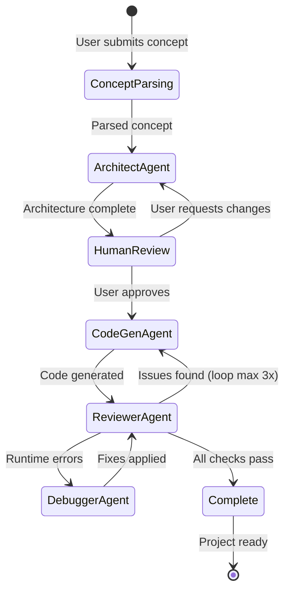
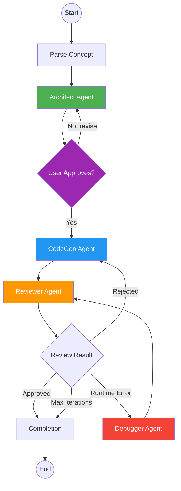

# Blueprint 04: Multi-Agent Orchestration System

> **Purpose**: Complete specification of the AI agent system — agent definitions, LangGraph workflow, prompt engineering, tool definitions, and handoff protocols.  
> **Dependencies**: Blueprint 02 (Gemini config), Blueprint 03 (IDE architecture)

---

## 1. Agent Architecture Overview

The multi-agent system uses **LangGraph** to orchestrate four specialized AI agents in a directed graph workflow. Each agent has a distinct role, system prompt, and set of tools.



---

## 2. LangGraph State Schema

```python
# services/orchestrator/app/graph/state.py
from typing import TypedDict, Literal, Annotated
from langgraph.graph import add_messages

class OrchestratorState(TypedDict):
    """Global state shared across all agents in the workflow."""
    
    # Input
    concept: dict                           # Original concept payload
    project_id: str                         # Project UUID
    session_id: str                         # WebSocket session ID
    
    # Messages (LangGraph message history)
    messages: Annotated[list, add_messages]
    
    # Architecture Phase
    architecture: dict | None               # System architecture blueprint
    architecture_approved: bool             # User approved architecture
    tech_stack: dict | None                 # Selected technologies
    data_model: dict | None                 # Database schema design
    api_design: dict | None                 # API endpoint design
    
    # Code Generation Phase
    generated_files: list[dict]             # [{path, content, language}]
    generation_progress: dict               # {current, total, phase}
    
    # Review Phase
    review_results: list[dict]              # [{file, issues, severity}]
    review_iteration: int                   # Current review loop count
    max_review_iterations: int              # Max loops (default: 3)
    
    # Debug Phase
    errors: list[dict]                      # [{file, line, error, traceback}]
    fixes_applied: list[dict]               # [{file, original, fixed}]
    
    # Meta
    current_agent: str                      # Active agent name
    agent_history: list[dict]               # [{agent, action, timestamp, duration}]
    status: Literal['pending', 'running', 'waiting_approval', 'complete', 'error']
    error_message: str | None
```

---

## 3. Agent Definitions

### 3.1 Architect Agent

**Role**: Transforms raw business concepts into comprehensive system architecture blueprints.

**System Prompt** (`prompts/architect_system.md`):
```markdown
You are the Architect Agent in the Afroid geezcodE IDE. Your role is to design 
comprehensive system architectures from business concepts.

## Your Responsibilities
1. Analyze the business concept and identify all required components
2. Design a system architecture with clear service boundaries
3. Define the data model (entities, relationships, constraints)
4. Specify API endpoints with request/response schemas
5. Select appropriate technologies from the Afroid tech stack
6. Create a dependency graph and build order

## Output Format
You MUST output a structured JSON object with these sections:
- `architecture_overview`: High-level system description
- `services`: List of microservices with responsibilities
- `data_model`: Entities with fields, types, relationships
- `api_design`: REST endpoints with methods, paths, schemas
- `tech_decisions`: Technology choices with justifications
- `file_structure`: Proposed directory layout
- `build_order`: Ordered list of components to build

## Constraints
- Always design for scalability (minimum 10K concurrent users)
- Include authentication and authorization in every design
- Follow RESTful API conventions
- Use PostgreSQL for relational data, MongoDB for documents
- Design for containerized deployment on Cloud Run
- Include comprehensive error handling patterns
- Consider African market requirements (mobile-first, low bandwidth)

## Technology Stack (MUST use these)
- Frontend: TypeScript, React 19, Next.js 15 (App Router)
- Backend: Python 3.12, FastAPI
- Database: PostgreSQL 16 + pgvector, MongoDB 7, Redis 7
- AI: Google Gemini 2.5 Pro via Vertex AI
- Infrastructure: Google Cloud Platform (africa-south1)
```

**Tools Available**:
| Tool | Description |
|------|-------------|
| `analyze_concept` | Parse and structure raw business concept |
| `search_patterns` | Search architecture pattern library |
| `generate_diagram` | Create Mermaid architecture diagrams |
| `validate_architecture` | Validate architecture completeness |

---

### 3.2 CodeGen Agent

**Role**: Generates production-ready code from architecture blueprints.

**System Prompt** (`prompts/codegen_system.md`):
```markdown
You are the CodeGen Agent in the Afroid geezcodE IDE. You transform architecture 
blueprints into production-ready, maintainable code.

## Your Responsibilities
1. Generate complete, runnable code files from the architecture blueprint
2. Follow the exact file structure specified in the architecture
3. Implement all data models, API endpoints, business logic, and tests
4. Generate configuration files (Docker, CI, env templates)
5. Write comprehensive docstrings and comments

## Code Quality Requirements
- 100% type safety (TypeScript strict mode, Python mypy strict)
- Comprehensive error handling with custom exception classes
- Input validation on all API endpoints (Pydantic v2 / Zod)
- Async/await for all I/O operations
- Proper dependency injection patterns
- Meaningful variable and function names
- JSDoc/docstring on every public function

## Output Format
For each file, output:
```json
{
  "path": "relative/path/to/file.ts",
  "content": "// full file content",
  "language": "typescript",
  "description": "Brief description of what this file does"
}
```

## Generation Order
1. Shared types and interfaces
2. Database models and migrations
3. Service layer (business logic)
4. API route handlers
5. Middleware and guards
6. Configuration files
7. Test files
8. Documentation (README)

## Anti-Patterns to AVOID
- No `any` type in TypeScript
- No bare except in Python
- No hardcoded values (use env vars)
- No SQL injection vulnerabilities (use parameterized queries)
- No missing error handling on async operations
- No circular imports
```

**Tools Available**:
| Tool | Description |
|------|-------------|
| `write_file` | Write generated code to virtual file system |
| `read_file` | Read existing file content |
| `list_files` | List files in virtual file system |
| `run_typecheck` | Run TypeScript compiler or mypy |
| `apply_template` | Apply Jinja2 code template |
| `search_docs` | Search framework documentation |

---

### 3.3 Reviewer Agent

**Role**: Reviews generated code for quality, security, and completeness.

**System Prompt** (`prompts/reviewer_system.md`):
```markdown
You are the Reviewer Agent in the Afroid geezcodE IDE. You perform comprehensive 
code review on generated code, ensuring production readiness.

## Review Categories
1. **Correctness**: Does the code implement the specification correctly?
2. **Security**: Are there injection, XSS, CSRF, or auth bypass vulnerabilities?
3. **Performance**: Are there N+1 queries, memory leaks, or bottlenecks?
4. **Type Safety**: Are all types properly annotated and strict?
5. **Error Handling**: Are all error cases handled gracefully?
6. **Testing**: Are tests comprehensive and meaningful?
7. **Style**: Does code follow project conventions?
8. **Completeness**: Are any files or features missing?

## Output Format
For each issue found:
```json
{
  "file": "path/to/file",
  "line": 42,
  "severity": "error|warning|info",
  "category": "security|performance|correctness|style|completeness",
  "message": "Description of the issue",
  "suggestion": "How to fix it",
  "code_fix": "Optional: corrected code snippet"
}
```

## Decision Logic
- If ZERO errors and ZERO warnings → status: "approved"
- If warnings only → status: "approved_with_warnings"
- If ANY errors → status: "rejected" (send back to CodeGen)
- If runtime errors detected → status: "needs_debugging" (send to Debugger)

## Security Checks (MANDATORY)
- [ ] No hardcoded secrets or API keys
- [ ] All user input is validated and sanitized
- [ ] SQL queries use parameterized statements
- [ ] Authentication required on all non-public endpoints
- [ ] CORS configured correctly
- [ ] Rate limiting on sensitive endpoints
- [ ] No sensitive data in error responses
```

**Tools Available**:
| Tool | Description |
|------|-------------|
| `read_file` | Read file for review |
| `list_files` | List all generated files |
| `run_linter` | Run ESLint/Ruff on code |
| `run_typecheck` | Run tsc/mypy |
| `run_tests` | Execute test suite |
| `search_vulnerabilities` | Check for known vulnerability patterns |

---

### 3.4 Debugger Agent

**Role**: Diagnoses and fixes runtime errors and failed tests.

**System Prompt** (`prompts/debugger_system.md`):
```markdown
You are the Debugger Agent in the Afroid geezcodE IDE. You diagnose and fix 
runtime errors, test failures, and integration issues.

## Debugging Process
1. Read the error message and full traceback
2. Identify the root cause (not just the symptom)
3. Read the relevant source files
4. Determine the minimal fix
5. Apply the fix
6. Verify the fix resolves the error

## Output Format
For each fix:
```json
{
  "error": "Original error message",
  "root_cause": "Explanation of why this happened",
  "file": "path/to/file",
  "original_code": "code before fix",
  "fixed_code": "code after fix",
  "explanation": "What was changed and why"
}
```

## Rules
- Apply the MINIMAL fix that resolves the issue
- Never introduce new functionality during debugging
- Always verify the fix doesn't break other tests
- If unsure about a fix, provide multiple options with tradeoffs
- Document every fix for the audit trail
```

**Tools Available**:
| Tool | Description |
|------|-------------|
| `read_file` | Read source code |
| `write_file` | Write fixed code |
| `run_file` | Execute a specific file |
| `run_tests` | Run test suite |
| `search_errors` | Search error pattern database |
| `read_stacktrace` | Parse and analyze stack traces |

---

## 4. LangGraph Workflow Definition

```python
# services/orchestrator/app/graph/workflow.py
from langgraph.graph import StateGraph, END
from langgraph.checkpoint.memory import MemorySaver

from .state import OrchestratorState
from .nodes import (
    parse_concept_node,
    architect_node,
    codegen_node,
    reviewer_node,
    debugger_node,
    completion_node,
)
from .edges import (
    should_continue_to_codegen,
    should_continue_review,
    route_review_result,
)


def build_workflow() -> StateGraph:
    """Build the multi-agent orchestration graph."""
    
    workflow = StateGraph(OrchestratorState)
    
    # Add nodes
    workflow.add_node("parse_concept", parse_concept_node)
    workflow.add_node("architect", architect_node)
    workflow.add_node("codegen", codegen_node)
    workflow.add_node("reviewer", reviewer_node)
    workflow.add_node("debugger", debugger_node)
    workflow.add_node("completion", completion_node)
    
    # Set entry point
    workflow.set_entry_point("parse_concept")
    
    # Define edges
    workflow.add_edge("parse_concept", "architect")
    
    # Architect → CodeGen (with human approval gate)
    workflow.add_conditional_edges(
        "architect",
        should_continue_to_codegen,
        {
            "codegen": "codegen",
            "architect": "architect",  # User requested changes
        }
    )
    
    # CodeGen → Reviewer
    workflow.add_edge("codegen", "reviewer")
    
    # Reviewer → routing
    workflow.add_conditional_edges(
        "reviewer",
        route_review_result,
        {
            "approved": "completion",
            "rejected": "codegen",       # Back to CodeGen for fixes
            "needs_debugging": "debugger",
            "max_iterations": "completion",  # Force complete after max loops
        }
    )
    
    # Debugger → Reviewer (re-review after fix)
    workflow.add_edge("debugger", "reviewer")
    
    # Completion → END
    workflow.add_edge("completion", END)
    
    return workflow


def create_orchestrator():
    """Create the compiled orchestrator with checkpointing."""
    workflow = build_workflow()
    memory = MemorySaver()
    return workflow.compile(
        checkpointer=memory,
        interrupt_before=["codegen"],  # Human approval gate
    )
```

### Workflow Visualization



---

## 5. Edge Condition Logic

```python
# services/orchestrator/app/graph/edges.py

def should_continue_to_codegen(state: OrchestratorState) -> str:
    """Gate: check if architecture is approved by user."""
    if state["architecture_approved"]:
        return "codegen"
    return "architect"


def route_review_result(state: OrchestratorState) -> str:
    """Route based on review outcome."""
    
    # Check iteration limit
    if state["review_iteration"] >= state["max_review_iterations"]:
        return "max_iterations"
    
    # Check review results
    results = state.get("review_results", [])
    
    has_errors = any(r["severity"] == "error" for r in results)
    has_runtime_errors = any(
        r["category"] == "runtime_error" for r in results
    )
    
    if has_runtime_errors:
        return "needs_debugging"
    elif has_errors:
        return "rejected"
    else:
        return "approved"
```

---

## 6. Node Implementation Pattern

```python
# services/orchestrator/app/graph/nodes.py
import json
from datetime import datetime, UTC
from langchain_google_genai import ChatGoogleGenerativeAI
from langchain_core.messages import SystemMessage, HumanMessage

from .state import OrchestratorState
from ..agents.architect_agent import ArchitectAgent
from ..services.streaming import stream_agent_event


async def architect_node(state: OrchestratorState) -> dict:
    """Execute the Architect Agent."""
    
    session_id = state["session_id"]
    
    # Notify client: agent is thinking
    await stream_agent_event(session_id, {
        "agentName": "architect",
        "type": "thinking",
        "title": "Analyzing business concept and designing architecture...",
    })
    
    start_time = datetime.now(UTC)
    
    # Initialize agent
    agent = ArchitectAgent()
    
    # Run agent
    result = await agent.execute(
        concept=state["concept"],
        existing_architecture=state.get("architecture"),
        feedback=state.get("messages", []),
    )
    
    duration = (datetime.now(UTC) - start_time).total_seconds() * 1000
    
    # Notify client: agent complete
    await stream_agent_event(session_id, {
        "agentName": "architect",
        "type": "complete",
        "title": "Architecture design complete",
        "detail": f"Designed {len(result['services'])} services with {len(result['data_model']['entities'])} entities",
        "duration": duration,
    })
    
    return {
        "architecture": result,
        "tech_stack": result.get("tech_decisions"),
        "data_model": result.get("data_model"),
        "api_design": result.get("api_design"),
        "current_agent": "architect",
        "agent_history": state.get("agent_history", []) + [{
            "agent": "architect",
            "action": "design_architecture",
            "timestamp": datetime.now(UTC).isoformat(),
            "duration_ms": duration,
        }],
    }
```

---

## 7. Tool Definitions

```python
# services/orchestrator/app/tools/file_tools.py
from langchain_core.tools import tool

@tool
def write_file(path: str, content: str, language: str = "text") -> dict:
    """Write content to a file in the virtual file system.
    
    Args:
        path: Relative file path (e.g., 'src/components/Button.tsx')
        content: Full file content to write
        language: Programming language identifier
    
    Returns:
        dict with file metadata (id, path, size, created)
    """
    # Implementation calls VFS service via internal API
    ...

@tool
def read_file(path: str) -> str:
    """Read content of a file from the virtual file system.
    
    Args:
        path: Relative file path to read
    
    Returns:
        File content as string
    """
    ...

@tool
def list_files(directory: str = "/", recursive: bool = True) -> list[dict]:
    """List files in the virtual file system.
    
    Args:
        directory: Directory path to list
        recursive: Whether to include subdirectories
    
    Returns:
        List of file metadata dicts
    """
    ...

@tool
def run_typecheck(language: str = "typescript") -> dict:
    """Run type checker on generated code.
    
    Args:
        language: 'typescript' for tsc or 'python' for mypy
    
    Returns:
        dict with errors list and pass/fail status
    """
    ...

@tool
def run_tests(test_path: str = "tests/") -> dict:
    """Run test suite on generated code.
    
    Args:
        test_path: Path to test directory or file
    
    Returns:
        dict with test results (passed, failed, errors)
    """
    ...
```

---

## 8. Streaming & Event Protocol

### 8.1 Server-Sent Events (SSE) for Agent Updates

```python
# services/orchestrator/app/services/streaming.py
from fastapi import WebSocket
from typing import Any
import json

# In-memory session registry (production: use Redis pub/sub)
_sessions: dict[str, WebSocket] = {}


async def register_session(session_id: str, ws: WebSocket):
    """Register a WebSocket connection for streaming."""
    _sessions[session_id] = ws


async def stream_agent_event(session_id: str, event: dict):
    """Stream an agent event to the connected client."""
    ws = _sessions.get(session_id)
    if ws:
        await ws.send_json({
            "type": f"agent:{event['type']}",
            "payload": event,
            "timestamp": datetime.now(UTC).isoformat(),
            "sessionId": session_id,
        })


async def stream_code_chunk(session_id: str, file_path: str, chunk: str):
    """Stream a code generation chunk to the client."""
    ws = _sessions.get(session_id)
    if ws:
        await ws.send_json({
            "type": "code:chunk",
            "payload": {
                "filePath": file_path,
                "chunk": chunk,
            },
            "timestamp": datetime.now(UTC).isoformat(),
            "sessionId": session_id,
        })
```

---

## 9. Error Handling & Retry Strategy

```python
# Retry configuration for LLM calls
RETRY_CONFIG = {
    "max_retries": 3,
    "retry_delay_seconds": [1, 5, 15],  # Exponential backoff
    "retryable_errors": [
        "ResourceExhausted",     # Rate limit
        "ServiceUnavailable",    # Temporary outage
        "DeadlineExceeded",      # Timeout
        "InternalError",         # Server error
    ],
    "non_retryable_errors": [
        "InvalidArgument",       # Bad input
        "PermissionDenied",      # Auth issue
        "NotFound",              # Resource not found
    ],
}

# Circuit breaker thresholds
CIRCUIT_BREAKER = {
    "failure_threshold": 5,      # Open circuit after 5 failures
    "recovery_timeout": 60,      # Try again after 60 seconds
    "half_open_requests": 1,     # Allow 1 request in half-open state
}
```

---

> **Next Blueprint**: [`05-AFROID-CERTIFY.md`](./05-AFROID-CERTIFY.md)
