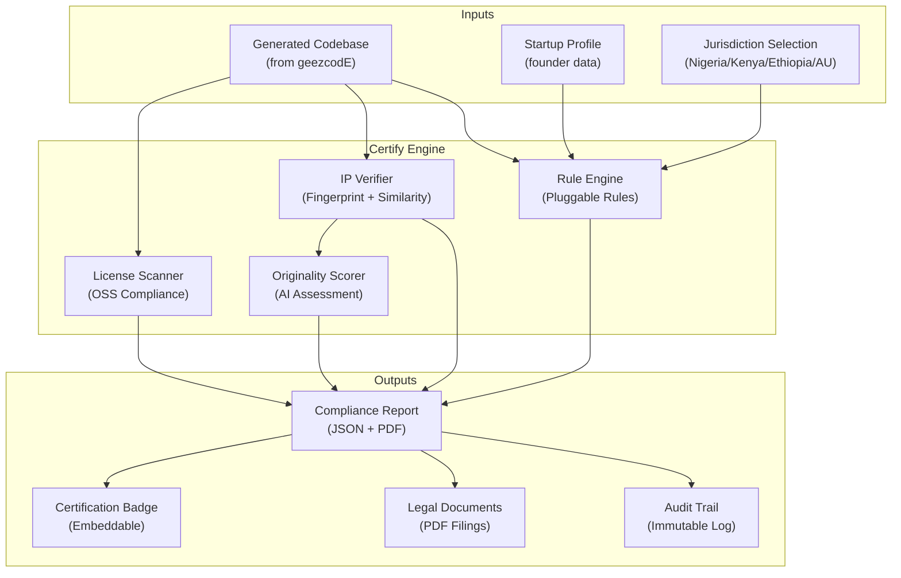
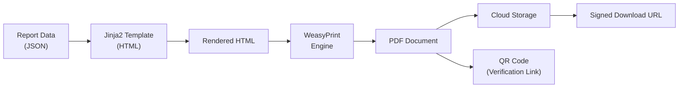

# Blueprint 05: Afroid Certify — Compliance & IP Verification

> **Purpose**: Complete specification for the RegTech compliance engine, IP verification, audit trail, and document generation systems.  
> **Dependencies**: Blueprint 07 (data models), Blueprint 08 (API contracts)

---

## 1. System Overview

Afroid Certify is a **Regulatory Technology (RegTech)** layer that audits generated codebases, verifies IP originality, generates compliance documentation, and maintains immutable audit trails for African Startup Act registrations.



---

## 2. Compliance Rule Engine

### 2.1 Architecture

The rule engine uses a **pluggable rule pattern** where each jurisdiction's rules are self-contained modules.

```python
# services/certify/app/engine/rule_engine.py
from abc import ABC, abstractmethod
from dataclasses import dataclass
from enum import Enum


class RuleSeverity(str, Enum):
    CRITICAL = "critical"     # Must fix: blocks certification
    MAJOR = "major"           # Should fix: flags in report
    MINOR = "minor"           # Nice to fix: informational
    INFO = "info"             # Informational only


class RuleCategory(str, Enum):
    LEGAL_STRUCTURE = "legal_structure"
    DATA_PROTECTION = "data_protection"
    IP_COMPLIANCE = "ip_compliance"
    FINANCIAL = "financial"
    TECHNICAL = "technical"
    DOCUMENTATION = "documentation"


@dataclass
class RuleResult:
    rule_id: str                    # Unique rule identifier
    rule_name: str                  # Human-readable name
    category: RuleCategory
    severity: RuleSeverity
    passed: bool
    message: str                    # Result explanation
    recommendation: str | None      # How to fix (if failed)
    evidence: dict | None           # Supporting data
    jurisdiction: str               # Which Startup Act


class ComplianceRule(ABC):
    """Base class for all compliance rules."""
    
    @property
    @abstractmethod
    def rule_id(self) -> str: ...
    
    @property
    @abstractmethod
    def rule_name(self) -> str: ...
    
    @property
    @abstractmethod
    def category(self) -> RuleCategory: ...
    
    @property
    @abstractmethod
    def severity(self) -> RuleSeverity: ...
    
    @property
    @abstractmethod
    def jurisdiction(self) -> str: ...
    
    @abstractmethod
    async def evaluate(
        self, 
        codebase: 'CodebaseContext',
        profile: 'StartupProfile',
    ) -> RuleResult:
        """Evaluate this rule against the codebase and profile."""
        ...


class RuleEngine:
    """Evaluates a codebase against a set of compliance rules."""
    
    def __init__(self):
        self._rules: dict[str, list[ComplianceRule]] = {}
        self._load_rules()
    
    def _load_rules(self):
        """Auto-discover and register all rule modules."""
        # Dynamically import all rule files from engine/rules/
        ...
    
    async def evaluate(
        self,
        codebase: 'CodebaseContext',
        profile: 'StartupProfile',
        jurisdictions: list[str],
    ) -> 'ComplianceReport':
        """Run all applicable rules and generate report."""
        results: list[RuleResult] = []
        
        for jurisdiction in jurisdictions:
            rules = self._rules.get(jurisdiction, [])
            for rule in rules:
                result = await rule.evaluate(codebase, profile)
                results.append(result)
        
        return ComplianceReport(
            results=results,
            overall_status=self._calculate_status(results),
            score=self._calculate_score(results),
            timestamp=datetime.now(UTC),
        )
    
    def _calculate_status(self, results: list[RuleResult]) -> str:
        if any(not r.passed and r.severity == RuleSeverity.CRITICAL for r in results):
            return "failed"
        if any(not r.passed and r.severity == RuleSeverity.MAJOR for r in results):
            return "conditional"
        return "passed"
    
    def _calculate_score(self, results: list[RuleResult]) -> float:
        if not results:
            return 0.0
        passed = sum(1 for r in results if r.passed)
        return round(passed / len(results) * 100, 1)
```

### 2.2 Jurisdiction Rules

#### Nigeria Startup Act Rules

```python
# services/certify/app/engine/rules/nigeria_startup_act.py

class NigeriaBusinessRegistration(ComplianceRule):
    rule_id = "NG-001"
    rule_name = "Business Registration (CAC)"
    category = RuleCategory.LEGAL_STRUCTURE
    severity = RuleSeverity.CRITICAL
    jurisdiction = "nigeria"
    
    async def evaluate(self, codebase, profile) -> RuleResult:
        """Check for CAC registration documentation."""
        has_cac = profile.documents.get("cac_certificate") is not None
        return RuleResult(
            rule_id=self.rule_id,
            rule_name=self.rule_name,
            category=self.category,
            severity=self.severity,
            passed=has_cac,
            message="CAC registration certificate found" if has_cac 
                    else "Missing CAC registration certificate",
            recommendation="Upload CAC registration certificate to proceed" if not has_cac else None,
            evidence={"document_type": "cac_certificate", "present": has_cac},
            jurisdiction=self.jurisdiction,
        )


class NigeriaDataProtection(ComplianceRule):
    rule_id = "NG-002"
    rule_name = "NDPR Compliance (Nigeria Data Protection Regulation)"
    category = RuleCategory.DATA_PROTECTION
    severity = RuleSeverity.CRITICAL
    jurisdiction = "nigeria"
    
    async def evaluate(self, codebase, profile) -> RuleResult:
        """Check codebase for NDPR compliance indicators."""
        checks = {
            "privacy_policy": self._has_privacy_policy(codebase),
            "consent_mechanism": self._has_consent_mechanism(codebase),
            "data_encryption": self._has_encryption(codebase),
            "data_retention_policy": self._has_retention_policy(codebase),
            "breach_notification": self._has_breach_notification(codebase),
        }
        all_passed = all(checks.values())
        failed = [k for k, v in checks.items() if not v]
        
        return RuleResult(
            rule_id=self.rule_id,
            rule_name=self.rule_name,
            category=self.category,
            severity=self.severity,
            passed=all_passed,
            message=f"NDPR compliance: {sum(checks.values())}/{len(checks)} checks passed",
            recommendation=f"Missing: {', '.join(failed)}" if failed else None,
            evidence=checks,
            jurisdiction=self.jurisdiction,
        )


class NigeriaStartupLabel(ComplianceRule):
    rule_id = "NG-003"
    rule_name = "Startup Label Qualification"
    category = RuleCategory.LEGAL_STRUCTURE
    severity = RuleSeverity.MAJOR
    jurisdiction = "nigeria"
    
    async def evaluate(self, codebase, profile) -> RuleResult:
        """Check if startup qualifies for Nigeria Startup Act label."""
        qualifies = (
            profile.incorporation_years <= 10
            and profile.annual_turnover_usd <= 500_000
            and profile.has_innovation_component
            and profile.registered_in_nigeria
        )
        return RuleResult(
            rule_id=self.rule_id,
            rule_name=self.rule_name,
            category=self.category,
            severity=self.severity,
            passed=qualifies,
            message="Qualifies for Startup Label" if qualifies 
                    else "Does not meet Startup Label criteria",
            recommendation=None if qualifies else "Review eligibility criteria",
            evidence={
                "years": profile.incorporation_years,
                "turnover": profile.annual_turnover_usd,
                "innovation": profile.has_innovation_component,
                "registered": profile.registered_in_nigeria,
            },
            jurisdiction=self.jurisdiction,
        )
```

#### Kenya Startup Act Rules

```python
# services/certify/app/engine/rules/kenya_startup_act.py

# Rules include:
# KE-001: Business Registration (BRS)
# KE-002: Data Protection Act 2019 compliance
# KE-003: Startup Committee registration eligibility
# KE-004: Innovation-driven enterprise verification
# KE-005: Tax incentive qualification
# KE-006: Foreign investment compliance (Capital Markets Act)
```

#### Ethiopia Startup Act Rules

```python
# services/certify/app/engine/rules/ethiopia_startup_act.py

# Rules include:
# ET-001: Business registration with MoTI
# ET-002: Investment Proclamation compliance
# ET-003: Digital Ethiopia 2025 alignment
# ET-004: Foreign exchange regulations
# ET-005: Intellectual property registration (EIPO)
```

#### African Union Digital Trade Rules

```python
# services/certify/app/engine/rules/au_digital_trade.py

# Rules include:
# AU-001: AfCFTA digital trade protocol compliance
# AU-002: Malabo Convention data protection
# AU-003: Cross-border data transfer compliance
# AU-004: Pan-African IP recognition
```

---

## 3. IP Verification Pipeline

### 3.1 Code Fingerprinting

```python
# services/certify/app/services/ip_verifier.py
from datasketch import MinHash, MinHashLSH
import hashlib

class IPVerifier:
    """Verifies intellectual property originality of generated code."""
    
    def __init__(self, lsh_threshold: float = 0.5):
        self.lsh = MinHashLSH(threshold=lsh_threshold, num_perm=128)
        self._load_reference_index()
    
    async def verify(self, codebase: 'CodebaseContext') -> 'IPReport':
        """Run full IP verification on a codebase."""
        
        # Step 1: Generate code fingerprints
        fingerprints = self._generate_fingerprints(codebase)
        
        # Step 2: Check similarity against known codebases
        similarities = self._check_similarity(fingerprints)
        
        # Step 3: Scan for license violations
        license_issues = await self._scan_licenses(codebase)
        
        # Step 4: AI originality scoring
        originality = await self._score_originality(codebase, similarities)
        
        return IPReport(
            fingerprints=fingerprints,
            similarities=similarities,
            license_issues=license_issues,
            originality_score=originality,
            verdict=self._determine_verdict(originality, license_issues),
        )
    
    def _generate_fingerprints(self, codebase: 'CodebaseContext') -> dict:
        """Generate MinHash fingerprints for each source file."""
        fingerprints = {}
        for file in codebase.source_files:
            mh = MinHash(num_perm=128)
            # Tokenize code (remove comments, normalize whitespace)
            tokens = self._tokenize_code(file.content, file.language)
            for token in tokens:
                mh.update(token.encode('utf-8'))
            fingerprints[file.path] = {
                'minhash': mh,
                'sha256': hashlib.sha256(file.content.encode()).hexdigest(),
                'token_count': len(tokens),
            }
        return fingerprints
    
    def _check_similarity(self, fingerprints: dict) -> list[dict]:
        """Check fingerprints against reference codebase index."""
        similarities = []
        for path, fp in fingerprints.items():
            matches = self.lsh.query(fp['minhash'])
            for match in matches:
                similarity = fp['minhash'].jaccard(match['minhash'])
                if similarity > 0.3:  # Report if >30% similar
                    similarities.append({
                        'source_file': path,
                        'match_source': match['source'],
                        'similarity': round(similarity, 3),
                        'match_license': match.get('license'),
                    })
        return similarities


@dataclass
class IPReport:
    fingerprints: dict
    similarities: list[dict]
    license_issues: list[dict]
    originality_score: float          # 0-100
    verdict: str                       # "original" | "derivative" | "violation"
    generated_at: str = field(default_factory=lambda: datetime.now(UTC).isoformat())
```

### 3.2 License Scanner

```python
# services/certify/app/services/license_scanner.py

class LicenseScanner:
    """Detects open source license usage and potential conflicts."""
    
    # License compatibility matrix
    COMPATIBLE_LICENSES = {
        "MIT": ["MIT", "Apache-2.0", "BSD-2-Clause", "BSD-3-Clause", "ISC"],
        "Apache-2.0": ["MIT", "Apache-2.0", "BSD-2-Clause", "BSD-3-Clause"],
        "GPL-3.0": ["GPL-3.0", "AGPL-3.0"],  # Copyleft: restrictive
    }
    
    async def scan(self, codebase: 'CodebaseContext') -> list[dict]:
        """Scan codebase for license declarations and conflicts."""
        issues = []
        
        # Check package.json dependencies
        if pkg_json := codebase.get_file("package.json"):
            issues.extend(await self._scan_npm_licenses(pkg_json))
        
        # Check pyproject.toml dependencies
        if pyproject := codebase.get_file("pyproject.toml"):
            issues.extend(await self._scan_python_licenses(pyproject))
        
        # Check for license files in codebase
        license_files = codebase.find_files("LICENSE*")
        if not license_files:
            issues.append({
                "type": "missing_license",
                "severity": "major",
                "message": "No LICENSE file found in project root",
                "recommendation": "Add a LICENSE file to declare your project's license"
            })
        
        return issues
```

---

## 4. Audit Trail System

### 4.1 Immutable Audit Log Design

The audit trail uses an **append-only MongoDB collection** with hash chaining to ensure immutability.

```python
# services/certify/app/services/audit_trail.py
import hashlib
from motor.motor_asyncio import AsyncIOMotorCollection

class AuditTrail:
    """Append-only, hash-chained audit log."""
    
    def __init__(self, collection: AsyncIOMotorCollection):
        self.collection = collection
    
    async def append(self, entry: 'AuditEntry') -> str:
        """Append a new audit entry with hash chain."""
        
        # Get the previous entry's hash
        prev = await self.collection.find_one(
            {"project_id": entry.project_id},
            sort=[("sequence", -1)]
        )
        prev_hash = prev["entry_hash"] if prev else "GENESIS"
        
        # Calculate entry hash (includes previous hash for chaining)
        entry_data = {
            "project_id": entry.project_id,
            "sequence": (prev["sequence"] + 1) if prev else 0,
            "timestamp": datetime.now(UTC).isoformat(),
            "actor": entry.actor,
            "action": entry.action,
            "resource_type": entry.resource_type,
            "resource_id": entry.resource_id,
            "before_state_hash": entry.before_hash,
            "after_state_hash": entry.after_hash,
            "metadata": entry.metadata,
            "previous_hash": prev_hash,
        }
        
        entry_hash = hashlib.sha256(
            json.dumps(entry_data, sort_keys=True).encode()
        ).hexdigest()
        
        entry_data["entry_hash"] = entry_hash
        
        result = await self.collection.insert_one(entry_data)
        return str(result.inserted_id)
    
    async def verify_chain(self, project_id: str) -> bool:
        """Verify the integrity of the audit chain."""
        cursor = self.collection.find(
            {"project_id": project_id}
        ).sort("sequence", 1)
        
        prev_hash = "GENESIS"
        async for entry in cursor:
            # Recompute hash
            entry_data = {k: v for k, v in entry.items() 
                         if k not in ["_id", "entry_hash"]}
            computed = hashlib.sha256(
                json.dumps(entry_data, sort_keys=True).encode()
            ).hexdigest()
            
            if computed != entry["entry_hash"]:
                return False
            if entry["previous_hash"] != prev_hash:
                return False
            
            prev_hash = entry["entry_hash"]
        
        return True


@dataclass
class AuditEntry:
    project_id: str
    actor: str                    # user_id or "system"
    action: str                   # "certification_started", "ip_verified", etc.
    resource_type: str            # "codebase", "document", "report"
    resource_id: str
    before_hash: str | None       # SHA-256 of state before action
    after_hash: str | None        # SHA-256 of state after action
    metadata: dict | None = None  # Additional context
```

### 4.2 Audit Actions

| Action | Trigger | Logged Data |
|--------|---------|-------------|
| `certification_initiated` | User clicks "Certify" | Project ID, jurisdiction(s), initiator |
| `rules_evaluated` | Rule engine completes | Rule results, scores, pass/fail |
| `ip_verification_completed` | IP check finishes | Originality score, similarities found |
| `license_scan_completed` | License scanner finishes | License issues found |
| `document_generated` | Compliance doc created | Document type, template version |
| `certification_granted` | All checks pass | Certificate ID, expiry date |
| `certification_revoked` | Manual or auto revocation | Reason, revoker |
| `code_modified_post_cert` | Code changes after certification | Diff hash, re-certification required |

---

## 5. Document Generation

### 5.1 Document Types

| Document | Format | Purpose |
|----------|--------|---------|
| Compliance Certificate | PDF | Official certification of compliance |
| IP Originality Report | PDF | Detailed IP analysis report |
| Startup Act Filing | PDF/DOCX | Pre-filled regulatory filing forms |
| Technical Audit Report | PDF | Comprehensive technical audit |
| Audit Trail Export | PDF/CSV | Full audit history export |

### 5.2 PDF Generation Pipeline



### 5.3 Certificate Template Structure

```html
<!-- templates/docs/compliance_certificate.html.j2 -->
<!DOCTYPE html>
<html>
<head>
  <style>
    @page { size: A4; margin: 2cm; }
    body { font-family: 'Inter', sans-serif; color: #1a1a2e; }
    .certificate-border { border: 3px solid #d4af37; padding: 40px; }
    .header { text-align: center; margin-bottom: 30px; }
    .seal { width: 120px; margin: 20px auto; }
    .qr-code { position: absolute; bottom: 40px; right: 40px; width: 100px; }
  </style>
</head>
<body>
  <div class="certificate-border">
    <div class="header">
      
      <h1>Certificate of Compliance</h1>
      <h2>{{ jurisdiction_name }} Startup Act</h2>
    </div>
    
    <p>This certifies that</p>
    <h2 class="startup-name">{{ startup_name }}</h2>
    <p>has been evaluated against the requirements of the 
       {{ jurisdiction_name }} Startup Act and has achieved:</p>
    
    <div class="score-box">
      <span class="score">{{ compliance_score }}%</span>
      <span class="status">{{ compliance_status | upper }}</span>
    </div>
    
    <table class="results-table">
      <tr><th>Category</th><th>Rules</th><th>Passed</th><th>Status</th></tr>
      
      <tr>
        <td>{{ category.name }}</td>
        <td>{{ category.total }}</td>
        <td>{{ category.passed }}</td>
        <td>{{ "✓" if category.all_passed else "✗" }}</td>
      </tr>
      
    </table>
    
    <div class="footer">
      <p>Certificate ID: {{ certificate_id }}</p>
      <p>Issued: {{ issued_date }}</p>
      <p>Valid Until: {{ expiry_date }}</p>
      
    </div>
  </div>
</body>
</html>
```

---

## 6. Certification API Flow

```python
# services/certify/app/routes/certify.py
from fastapi import APIRouter, Depends, BackgroundTasks

router = APIRouter(prefix="/certify", tags=["certification"])

@router.post("/{project_id}")
async def initiate_certification(
    project_id: str,
    request: CertificationRequest,
    background_tasks: BackgroundTasks,
    current_user: User = Depends(get_current_user),
):
    """
    Initiate certification for a project.
    
    Steps:
    1. Validate project exists and user has access
    2. Create audit trail entry
    3. Queue certification job
    4. Return job ID for status polling
    """
    # Validate
    project = await get_project_or_404(project_id)
    authorize(current_user, project, "certify")
    
    # Create job
    job = await create_certification_job(
        project_id=project_id,
        jurisdictions=request.jurisdictions,
        initiated_by=current_user.id,
    )
    
    # Queue background processing
    background_tasks.add_task(
        run_certification_pipeline,
        job_id=job.id,
        project_id=project_id,
        jurisdictions=request.jurisdictions,
    )
    
    return {"job_id": job.id, "status": "queued"}


@router.get("/{project_id}/status/{job_id}")
async def get_certification_status(project_id: str, job_id: str):
    """Poll certification job status."""
    ...

@router.get("/{project_id}/report")
async def get_compliance_report(project_id: str):
    """Get the latest compliance report."""
    ...

@router.get("/{project_id}/certificate")
async def download_certificate(project_id: str):
    """Download the compliance certificate PDF."""
    ...
```

---

> **Next Blueprint**: [`06-AFROID-INCUBATE.md`](./06-AFROID-INCUBATE.md)
