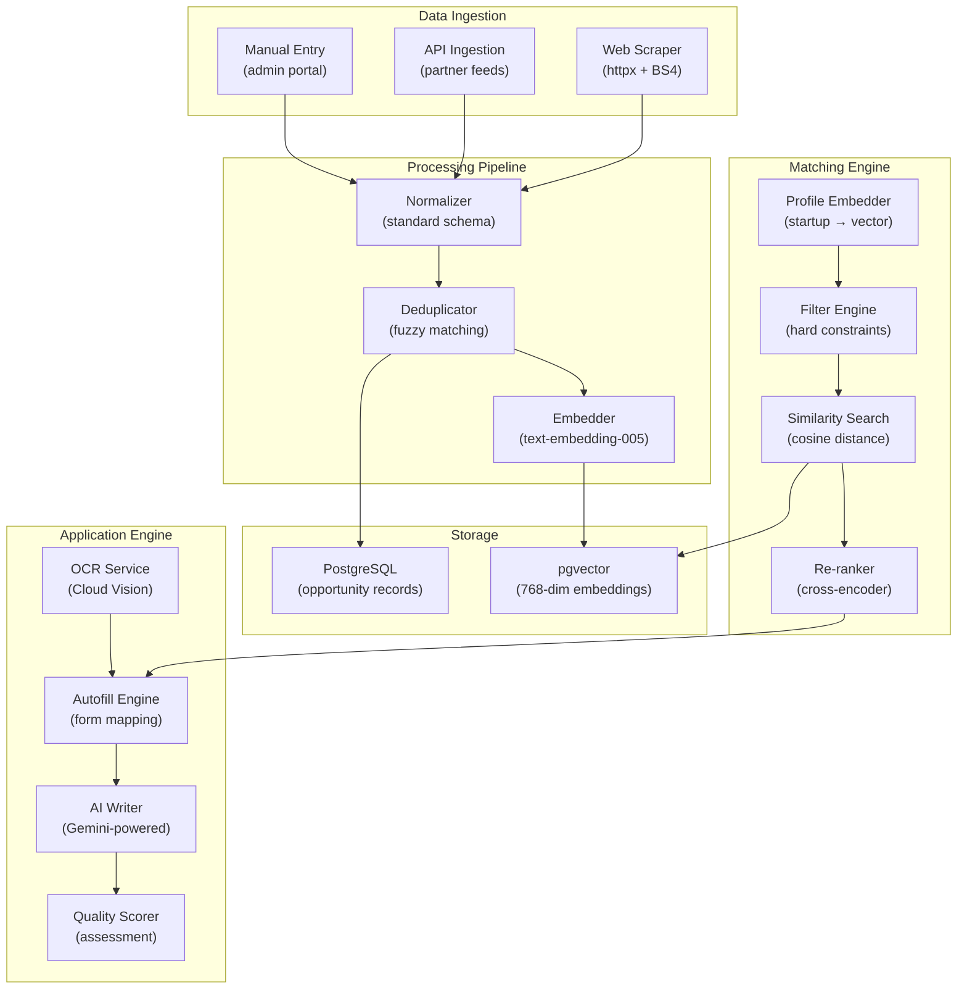

# Blueprint 06: Afroid Incubate — Non-Dilutive Funding Pipeline

> **Purpose**: Complete specification for the funding opportunity matching engine, OCR pipeline, autofill system, and AI writing engine.  
> **Dependencies**: Blueprint 07 (data models), Blueprint 08 (API contracts)

---

## 1. System Overview

Afroid Incubate connects startups to the **$2 trillion non-dilutive funding ecosystem** (grants, procurement, tax credits, subsidies). The system uses vector embeddings to match startup profiles against 3,000+ funding opportunities and auto-populates 95% of application fields.



---

## 2. Opportunity Data Model

### 2.1 Standard Schema

Every funding opportunity is normalized to this schema regardless of source:

```python
# services/incubate/app/models/opportunity.py
from sqlalchemy import Column, String, Float, Date, ARRAY, JSON, Enum
from sqlalchemy.orm import Mapped, mapped_column
from pgvector.sqlalchemy import Vector

class Opportunity(Base):
    __tablename__ = "opportunities"
    
    id: Mapped[uuid.UUID] = mapped_column(primary_key=True, default=uuid.uuid4)
    
    # Core fields
    title: Mapped[str] = mapped_column(String(500), nullable=False)
    funder: Mapped[str] = mapped_column(String(300), nullable=False)
    funder_type: Mapped[str] = mapped_column(
        Enum("government", "foundation", "corporate", "multilateral", 
             "development_bank", "ngo", name="funder_type_enum")
    )
    
    # Funding details
    funding_type: Mapped[str] = mapped_column(
        Enum("grant", "procurement", "tax_credit", "subsidy", "prize",
             "loan_guarantee", "equity_free", name="funding_type_enum")
    )
    amount_min: Mapped[float | None] = mapped_column(Float)
    amount_max: Mapped[float | None] = mapped_column(Float)
    currency: Mapped[str] = mapped_column(String(3), default="USD")
    
    # Eligibility
    eligible_regions: Mapped[list[str]] = mapped_column(ARRAY(String))
    eligible_sectors: Mapped[list[str]] = mapped_column(ARRAY(String))
    eligible_stages: Mapped[list[str]] = mapped_column(ARRAY(String))  # seed, early, growth
    eligibility_criteria: Mapped[dict] = mapped_column(JSON, default={})
    
    # Timeline
    deadline: Mapped[date | None] = mapped_column(Date)
    is_rolling: Mapped[bool] = mapped_column(default=False)
    cycle: Mapped[str | None] = mapped_column(String(50))  # annual, quarterly, etc.
    
    # Content
    description: Mapped[str] = mapped_column(nullable=False)
    requirements: Mapped[dict] = mapped_column(JSON, default={})
    application_url: Mapped[str | None] = mapped_column(String(2000))
    source_url: Mapped[str] = mapped_column(String(2000), nullable=False)
    
    # Metadata
    status: Mapped[str] = mapped_column(
        Enum("active", "expired", "upcoming", "paused", name="opp_status_enum"),
        default="active"
    )
    last_verified: Mapped[datetime] = mapped_column()
    created_at: Mapped[datetime] = mapped_column(default=func.now())
    updated_at: Mapped[datetime] = mapped_column(default=func.now(), onupdate=func.now())
    
    # Vector embedding (768 dimensions from text-embedding-005)
    embedding: Mapped[list[float]] = mapped_column(Vector(768))
    
    # Indexes
    __table_args__ = (
        Index('ix_opp_embedding_hnsw', 'embedding', 
              postgresql_using='hnsw',
              postgresql_with={'m': 16, 'ef_construction': 64},
              postgresql_ops={'embedding': 'vector_cosine_ops'}),
        Index('ix_opp_deadline', 'deadline'),
        Index('ix_opp_status', 'status'),
        Index('ix_opp_funding_type', 'funding_type'),
    )
```

### 2.2 Embedding Strategy

```python
# What gets embedded for each opportunity
def create_opportunity_embedding_text(opp: Opportunity) -> str:
    """Create the text representation for embedding."""
    parts = [
        f"Title: {opp.title}",
        f"Funder: {opp.funder}",
        f"Type: {opp.funding_type}",
        f"Amount: {opp.amount_min}-{opp.amount_max} {opp.currency}",
        f"Regions: {', '.join(opp.eligible_regions)}",
        f"Sectors: {', '.join(opp.eligible_sectors)}",
        f"Stages: {', '.join(opp.eligible_stages)}",
        f"Description: {opp.description[:1000]}",
    ]
    return "\n".join(parts)
```

---

## 3. Opportunity Ingestion Pipeline

### 3.1 Web Scraper

```python
# services/incubate/app/ingestion/scraper.py
import httpx
from bs4 import BeautifulSoup

class OpportunityScraper:
    """Scrapes funding opportunities from configured sources."""
    
    # Configured data sources
    SOURCES = [
        {
            "name": "grants.gov",
            "url": "https://www.grants.gov/search/...",
            "parser": "grants_gov_parser",
            "schedule": "daily",
        },
        {
            "name": "fundsforngos",
            "url": "https://www2.fundsforngos.org/...",
            "parser": "fundsforngos_parser",
            "schedule": "daily",
        },
        {
            "name": "sam.gov",
            "url": "https://sam.gov/...",
            "parser": "sam_gov_parser",
            "schedule": "daily",
        },
        {
            "name": "african_development_bank",
            "url": "https://www.afdb.org/...",
            "parser": "afdb_parser",
            "schedule": "weekly",
        },
        {
            "name": "undp",
            "url": "https://procurement.undp.org/...",
            "parser": "undp_parser",
            "schedule": "daily",
        },
        # ... 20+ additional sources
    ]
    
    async def scrape_all(self) -> list[dict]:
        """Scrape all configured sources."""
        results = []
        async with httpx.AsyncClient(timeout=30) as client:
            for source in self.SOURCES:
                try:
                    raw_data = await self._fetch(client, source)
                    parsed = await self._parse(raw_data, source["parser"])
                    results.extend(parsed)
                except Exception as e:
                    logger.error(f"Scraping failed for {source['name']}: {e}")
        return results
    
    async def _fetch(self, client: httpx.AsyncClient, source: dict) -> str:
        """Fetch raw HTML/JSON from source."""
        response = await client.get(source["url"])
        response.raise_for_status()
        return response.text
    
    async def _parse(self, raw: str, parser_name: str) -> list[dict]:
        """Parse raw data using source-specific parser."""
        parser = getattr(self, parser_name)
        return parser(raw)
```

### 3.2 Normalizer

```python
# services/incubate/app/ingestion/normalizer.py

class OpportunityNormalizer:
    """Normalizes raw scraped data into standard opportunity schema."""
    
    # Region name mapping
    REGION_MAP = {
        "nigeria": "NG", "kenya": "KE", "south africa": "ZA",
        "ethiopia": "ET", "ghana": "GH", "egypt": "EG",
        "africa": "AFRICA", "sub-saharan africa": "SSA",
        "global": "GLOBAL", "developing countries": "DEVELOPING",
    }
    
    # Sector mapping
    SECTOR_MAP = {
        "technology": "tech", "information technology": "tech",
        "agriculture": "agri", "agritech": "agri",
        "health": "health", "healthcare": "health",
        "fintech": "fintech", "financial services": "fintech",
        "education": "edtech", "edtech": "edtech",
        "clean energy": "cleantech", "renewable energy": "cleantech",
        "e-commerce": "ecommerce",
    }
    
    def normalize(self, raw: dict) -> dict:
        """Normalize a raw opportunity into standard schema."""
        return {
            "title": self._clean_text(raw.get("title", "")),
            "funder": self._clean_text(raw.get("funder", raw.get("organization", ""))),
            "funder_type": self._classify_funder(raw),
            "funding_type": self._classify_funding_type(raw),
            "amount_min": self._parse_amount(raw.get("amount_min")),
            "amount_max": self._parse_amount(raw.get("amount_max", raw.get("amount"))),
            "currency": raw.get("currency", "USD").upper(),
            "eligible_regions": self._normalize_regions(raw.get("regions", [])),
            "eligible_sectors": self._normalize_sectors(raw.get("sectors", [])),
            "eligible_stages": raw.get("stages", ["any"]),
            "deadline": self._parse_date(raw.get("deadline")),
            "is_rolling": raw.get("is_rolling", False),
            "description": self._clean_text(raw.get("description", "")),
            "requirements": raw.get("requirements", {}),
            "application_url": raw.get("application_url"),
            "source_url": raw["source_url"],
        }
```

### 3.3 Deduplicator

```python
# services/incubate/app/ingestion/deduplicator.py
from rapidfuzz import fuzz

class Deduplicator:
    """Removes duplicate opportunities using fuzzy matching."""
    
    SIMILARITY_THRESHOLD = 85  # Percent
    
    async def deduplicate(
        self, 
        new_opps: list[dict], 
        existing_opps: list[dict],
    ) -> list[dict]:
        """Remove duplicates from new opportunities."""
        unique = []
        for new in new_opps:
            is_dupe = False
            for existing in existing_opps:
                title_sim = fuzz.ratio(new["title"], existing["title"])
                funder_sim = fuzz.ratio(new["funder"], existing["funder"])
                
                if title_sim >= self.SIMILARITY_THRESHOLD and funder_sim >= 80:
                    is_dupe = True
                    # Update existing if new has more info
                    await self._merge_updates(existing, new)
                    break
            
            if not is_dupe:
                unique.append(new)
        
        return unique
```

---

## 4. Matching Engine

### 4.1 Startup Profile Embedding

```python
# services/incubate/app/matcher/profile_embedder.py

class ProfileEmbedder:
    """Creates vector embeddings from startup profiles."""
    
    def create_profile_text(self, profile: 'StartupProfile') -> str:
        """Create text representation for embedding."""
        parts = [
            f"Company: {profile.company_name}",
            f"Industry: {profile.industry}",
            f"Stage: {profile.stage}",
            f"Country: {profile.country}",
            f"Region: {profile.region}",
            f"Team Size: {profile.team_size}",
            f"Revenue: {profile.annual_revenue}",
            f"Problem: {profile.problem_statement}",
            f"Solution: {profile.solution_description}",
            f"Technology: {', '.join(profile.technologies)}",
            f"Impact: {profile.impact_statement}",
            f"Target Market: {', '.join(profile.target_markets)}",
        ]
        
        # Include data from IDE (if available)
        if profile.ide_data:
            parts.extend([
                f"Technical Architecture: {profile.ide_data.get('architecture_summary', '')}",
                f"Tech Stack: {', '.join(profile.ide_data.get('tech_stack', []))}",
                f"Features: {', '.join(profile.ide_data.get('features', []))}",
            ])
        
        return "\n".join(parts)
    
    async def embed(self, profile: 'StartupProfile') -> list[float]:
        """Generate embedding vector for startup profile."""
        text = self.create_profile_text(profile)
        embedding = await self.embedding_service.embed(text)
        return embedding
```

### 4.2 Similarity Search

```python
# services/incubate/app/matcher/similarity_engine.py

class SimilarityEngine:
    """Performs vector similarity search for funding matches."""
    
    async def find_matches(
        self,
        profile_embedding: list[float],
        filters: 'MatchFilters',
        top_k: int = 50,
    ) -> list['MatchResult']:
        """Find top matching opportunities."""
        
        # Build filtered query with pgvector
        query = """
            SELECT 
                o.id,
                o.title,
                o.funder,
                o.funding_type,
                o.amount_min,
                o.amount_max,
                o.currency,
                o.deadline,
                o.description,
                o.eligible_regions,
                o.eligible_sectors,
                1 - (o.embedding <=> :query_vector) as similarity_score
            FROM opportunities o
            WHERE o.status = 'active'
        """
        
        params = {"query_vector": str(profile_embedding)}
        
        # Apply hard filters
        if filters.regions:
            query += " AND o.eligible_regions && :regions"
            params["regions"] = filters.regions
        
        if filters.min_amount:
            query += " AND (o.amount_max >= :min_amount OR o.amount_max IS NULL)"
            params["min_amount"] = filters.min_amount
        
        if filters.max_amount:
            query += " AND (o.amount_min <= :max_amount OR o.amount_min IS NULL)"
            params["max_amount"] = filters.max_amount
        
        if filters.funding_types:
            query += " AND o.funding_type = ANY(:funding_types)"
            params["funding_types"] = filters.funding_types
        
        if filters.deadline_after:
            query += " AND (o.deadline >= :deadline_after OR o.is_rolling = true)"
            params["deadline_after"] = filters.deadline_after
        
        if filters.sectors:
            query += " AND o.eligible_sectors && :sectors"
            params["sectors"] = filters.sectors
        
        query += " ORDER BY o.embedding <=> :query_vector LIMIT :limit"
        params["limit"] = top_k
        
        results = await self.db.execute(text(query), params)
        return [MatchResult(**row._mapping) for row in results]


@dataclass
class MatchFilters:
    regions: list[str] | None = None
    sectors: list[str] | None = None
    funding_types: list[str] | None = None
    min_amount: float | None = None
    max_amount: float | None = None
    deadline_after: date | None = None
    stages: list[str] | None = None


@dataclass
class MatchResult:
    id: str
    title: str
    funder: str
    funding_type: str
    amount_min: float | None
    amount_max: float | None
    currency: str
    deadline: date | None
    description: str
    eligible_regions: list[str]
    eligible_sectors: list[str]
    similarity_score: float      # 0.0 - 1.0
    match_reasons: list[str] = field(default_factory=list)  # Filled by re-ranker
```

### 4.3 Cross-Encoder Re-ranker

```python
# services/incubate/app/matcher/reranker.py

class CrossEncoderReranker:
    """Re-ranks top-K results using Gemini for more precise scoring."""
    
    async def rerank(
        self,
        profile: 'StartupProfile',
        candidates: list[MatchResult],
        top_n: int = 20,
    ) -> list[MatchResult]:
        """Re-rank candidates with detailed match reasoning."""
        
        prompt = f"""You are a funding opportunity matching expert. 
        
Given this startup profile:
{self._format_profile(profile)}

Rate each of these funding opportunities on a scale of 0-100 for relevance,
and provide 2-3 specific reasons why it's a good match.

Opportunities:
{self._format_candidates(candidates)}

Output JSON array:
[{{"id": "...", "relevance_score": 85, "reasons": ["reason1", "reason2"]}}]
"""
        
        response = await self.llm.generate(prompt)
        rankings = json.loads(response)
        
        # Merge AI rankings with vector similarity
        for candidate in candidates:
            ai_data = next((r for r in rankings if r["id"] == candidate.id), None)
            if ai_data:
                # Weighted combination: 40% vector + 60% AI
                candidate.similarity_score = (
                    0.4 * candidate.similarity_score + 
                    0.6 * (ai_data["relevance_score"] / 100)
                )
                candidate.match_reasons = ai_data["reasons"]
        
        # Sort by combined score
        candidates.sort(key=lambda x: x.similarity_score, reverse=True)
        return candidates[:top_n]
```

---

## 5. OCR & Document Processing

### 5.1 Google Cloud Vision Integration

```python
# services/incubate/app/ocr/vision_client.py
from google.cloud import vision

class VisionOCRClient:
    """Extracts text from documents using Google Cloud Vision API."""
    
    def __init__(self):
        self.client = vision.ImageAnnotatorClient()
    
    async def extract_text(self, file_bytes: bytes, mime_type: str) -> 'OCRResult':
        """Extract text from a document."""
        
        if mime_type == "application/pdf":
            return await self._process_pdf(file_bytes)
        else:
            return await self._process_image(file_bytes)
    
    async def _process_pdf(self, pdf_bytes: bytes) -> 'OCRResult':
        """Process multi-page PDF documents."""
        input_config = vision.InputConfig(
            content=pdf_bytes,
            mime_type="application/pdf",
        )
        feature = vision.Feature(type_=vision.Feature.Type.DOCUMENT_TEXT_DETECTION)
        request = vision.AnnotateFileRequest(
            input_config=input_config,
            features=[feature],
        )
        
        response = self.client.batch_annotate_files(requests=[request])
        
        pages = []
        for file_response in response.responses:
            for page_response in file_response.responses:
                annotation = page_response.full_text_annotation
                pages.append({
                    "text": annotation.text,
                    "blocks": self._extract_blocks(annotation),
                    "tables": self._extract_tables(annotation),
                })
        
        return OCRResult(pages=pages, confidence=self._avg_confidence(response))


@dataclass
class OCRResult:
    pages: list[dict]          # [{text, blocks, tables}]
    confidence: float          # Average confidence score
    raw_text: str = ""         # Full concatenated text
    structured_data: dict = field(default_factory=dict)  # Extracted key-value pairs
```

### 5.2 Document Parser

```python
# services/incubate/app/ocr/document_parser.py

class DocumentParser:
    """Extracts structured data from OCR results."""
    
    # Common fields to extract from business documents
    FIELD_PATTERNS = {
        "company_name": [
            r"company\s*name\s*[:：]\s*(.+)",
            r"business\s*name\s*[:：]\s*(.+)",
            r"organization\s*[:：]\s*(.+)",
        ],
        "registration_number": [
            r"reg(?:istration)?\s*(?:no|number|#)\s*[:：]\s*(\w+)",
            r"RC\s*(\d+)",
            r"BN\s*(\d+)",
        ],
        "date_incorporated": [
            r"date\s*(?:of\s*)?(?:incorp|registration)\w*\s*[:：]\s*([\d/\-\.]+)",
        ],
        "address": [
            r"(?:registered\s*)?address\s*[:：]\s*(.+?)(?:\n|$)",
        ],
        "revenue": [
            r"(?:annual\s*)?revenue\s*[:：]\s*[₦$€£]?\s*([\d,]+)",
            r"turnover\s*[:：]\s*[₦$€£]?\s*([\d,]+)",
        ],
        "employees": [
            r"(?:number\s*of\s*)?employees?\s*[:：]\s*(\d+)",
            r"team\s*size\s*[:：]\s*(\d+)",
        ],
    }
    
    async def parse(self, ocr_result: OCRResult) -> dict:
        """Extract structured data from OCR text."""
        extracted = {}
        full_text = ocr_result.raw_text
        
        for field, patterns in self.FIELD_PATTERNS.items():
            for pattern in patterns:
                match = re.search(pattern, full_text, re.IGNORECASE)
                if match:
                    extracted[field] = match.group(1).strip()
                    break
        
        # Use Gemini for complex extraction
        if len(extracted) < len(self.FIELD_PATTERNS) * 0.5:
            ai_extracted = await self._ai_extract(full_text)
            extracted.update(ai_extracted)
        
        return extracted
```

---

## 6. Autofill Engine

### 6.1 Form Field Mapping

```python
# services/incubate/app/autofill/form_mapper.py

class FormMapper:
    """Maps startup data to funding application form fields."""
    
    # Master field mapping: application_field → data_source
    FIELD_MAP = {
        # Organization Info
        "organization_name": "profile.company_name",
        "legal_name": "profile.legal_name",
        "registration_number": "documents.registration_number",
        "year_founded": "profile.founded_year",
        "country": "profile.country",
        "address": "profile.address",
        "website": "profile.website",
        "industry": "profile.industry",
        
        # Team
        "founder_name": "profile.founder.name",
        "founder_title": "profile.founder.title",
        "founder_email": "profile.founder.email",
        "founder_phone": "profile.founder.phone",
        "team_size": "profile.team_size",
        "team_description": "profile.team_description",
        
        # Business
        "problem_statement": "profile.problem_statement",
        "solution_description": "profile.solution_description",
        "target_market": "profile.target_market_description",
        "revenue_model": "profile.revenue_model",
        "annual_revenue": "profile.annual_revenue",
        "customer_count": "profile.customer_count",
        
        # Technical (from IDE)
        "tech_stack": "ide.tech_stack_summary",
        "architecture": "ide.architecture_summary",
        "product_stage": "profile.stage",
        
        # Funding
        "amount_requested": "application.amount_requested",
        "use_of_funds": "application.budget_breakdown",
        "previous_funding": "profile.previous_funding",
        
        # Impact
        "impact_statement": "profile.impact_statement",
        "sdg_alignment": "profile.sdg_goals",
        "jobs_created": "profile.jobs_created",
        "beneficiaries": "profile.beneficiaries",
    }
    
    async def autofill(
        self,
        opportunity: Opportunity,
        profile: 'StartupProfile',
        ide_data: dict | None,
        documents: dict | None,
    ) -> 'AutofillResult':
        """Auto-fill application fields from available data sources."""
        
        filled = {}
        missing = []
        confidence = {}
        
        data_sources = {
            "profile": profile,
            "ide": ide_data,
            "documents": documents,
        }
        
        for app_field, source_path in self.FIELD_MAP.items():
            value = self._resolve_path(data_sources, source_path)
            if value is not None:
                filled[app_field] = value
                confidence[app_field] = self._calculate_confidence(app_field, value)
            else:
                missing.append(app_field)
        
        # Calculate overall completion
        total_fields = len(self.FIELD_MAP)
        filled_count = len(filled)
        completion_pct = round(filled_count / total_fields * 100, 1)
        
        return AutofillResult(
            filled_fields=filled,
            missing_fields=missing,
            field_confidence=confidence,
            completion_percentage=completion_pct,
            requires_review=self._needs_review(confidence),
        )


@dataclass
class AutofillResult:
    filled_fields: dict[str, Any]       # field_name → value
    missing_fields: list[str]           # Fields that couldn't be auto-filled
    field_confidence: dict[str, float]  # field_name → confidence (0-1)
    completion_percentage: float         # Overall completion %
    requires_review: list[str]          # Fields needing human verification
```

---

## 7. AI Writing Engine

### 7.1 Grant Narrative Generator

```python
# services/incubate/app/writer/grant_composer.py

class GrantComposer:
    """AI-powered grant narrative writer optimized for institutional funding."""
    
    SECTIONS = [
        "executive_summary",
        "problem_statement",
        "proposed_solution",
        "methodology",
        "impact_and_outcomes",
        "sustainability_plan",
        "budget_justification",
        "organizational_capacity",
        "timeline_and_milestones",
    ]
    
    async def compose(
        self,
        opportunity: Opportunity,
        profile: 'StartupProfile',
        ide_data: dict | None,
        requirements: dict,
    ) -> 'GrantNarrative':
        """Compose a complete grant narrative."""
        
        sections = {}
        for section_name in self.SECTIONS:
            section_prompt = self._get_section_prompt(
                section_name, opportunity, profile, ide_data, requirements
            )
            
            # Generate with appropriate constraints
            content = await self.llm.generate(
                system_prompt=GRANT_WRITER_SYSTEM_PROMPT,
                user_prompt=section_prompt,
                temperature=0.7,
                max_tokens=self._get_word_limit(section_name, requirements) * 2,
            )
            
            # Apply tone adjustment
            content = await self.tone_adjuster.adjust(content, "institutional")
            
            sections[section_name] = {
                "content": content,
                "word_count": len(content.split()),
                "quality_score": await self.quality_scorer.score(content, section_name),
            }
        
        return GrantNarrative(
            sections=sections,
            overall_quality=self._overall_quality(sections),
            word_count=sum(s["word_count"] for s in sections.values()),
        )
    
    def _get_section_prompt(self, section, opp, profile, ide_data, reqs) -> str:
        """Build section-specific prompt with all context."""
        
        templates = {
            "executive_summary": f"""
Write a compelling executive summary for a grant application to {opp.funder}.

Startup: {profile.company_name}
Industry: {profile.industry}  
Country: {profile.country}
Problem: {profile.problem_statement}
Solution: {profile.solution_description}
Funding Requested: {reqs.get('amount_requested', 'Not specified')}

Requirements from the funder:
{json.dumps(opp.requirements, indent=2)}

Write in a professional, institutional tone. Be specific about impact metrics.
Word limit: {reqs.get('executive_summary_words', 300)} words.
""",
            # ... templates for each section
        }
        return templates.get(section, "")


GRANT_WRITER_SYSTEM_PROMPT = """You are an expert grant writer specializing in 
funding applications for African startups and social enterprises. 

Your writing style is:
- Professional and institutional (not casual or startup-jargon heavy)
- Evidence-based with specific metrics and data points
- Aligned with SDG (Sustainable Development Goals) frameworks
- Clear about theory of change and impact pathways
- Structured with clear topic sentences and logical flow

You NEVER:
- Use hyperbolic language ("revolutionary", "game-changing")
- Make unsubstantiated claims
- Use first person plural excessively
- Include buzzwords without substance
- Exceed specified word limits

You ALWAYS:
- Lead with the problem and its urgency
- Quantify impact where possible
- Connect to the funder's stated priorities
- Include sustainability and scalability plans
- Reference relevant regulatory frameworks
"""
```

### 7.2 Quality Scorer

```python
# services/incubate/app/writer/quality_scorer.py

class QualityScorer:
    """Assesses grant writing quality using AI evaluation."""
    
    CRITERIA = {
        "clarity": "Is the writing clear and easy to understand?",
        "specificity": "Does it include specific data, metrics, and examples?",
        "alignment": "Does it align with the funder's stated priorities?",
        "impact": "Does it clearly articulate measurable impact?",
        "feasibility": "Does it present a realistic and achievable plan?",
        "sustainability": "Does it address long-term sustainability?",
        "professionalism": "Is the tone appropriate for institutional funding?",
    }
    
    async def score(self, content: str, section_name: str) -> dict:
        """Score a section across all quality criteria."""
        
        prompt = f"""Evaluate this grant application section ({section_name}) 
on each criterion below. Score 1-10 and provide brief feedback.

Content:
{content}

Criteria:
{json.dumps(self.CRITERIA, indent=2)}

Output JSON: {{"criterion": {{"score": N, "feedback": "..."}}}}
"""
        
        response = await self.llm.generate(prompt, temperature=0.1)
        scores = json.loads(response)
        
        overall = sum(s["score"] for s in scores.values()) / len(scores)
        
        return {
            "criteria_scores": scores,
            "overall_score": round(overall, 1),
            "grade": self._score_to_grade(overall),
        }
    
    def _score_to_grade(self, score: float) -> str:
        if score >= 9: return "A+"
        if score >= 8: return "A"
        if score >= 7: return "B+"
        if score >= 6: return "B"
        if score >= 5: return "C"
        return "D"
```

---

## 8. Incubate API Endpoints

```python
# Key API routes for Afroid Incubate

# --- Opportunities ---
GET    /api/v1/opportunities                  # List with filters + pagination
GET    /api/v1/opportunities/{id}             # Get single opportunity
GET    /api/v1/opportunities/stats             # Aggregate statistics

# --- Matching ---
POST   /api/v1/matches                        # Find matches for startup
GET    /api/v1/matches/{match_id}             # Get match details
POST   /api/v1/matches/{match_id}/save         # Save match for later

# --- Applications ---
POST   /api/v1/applications                   # Start new application
GET    /api/v1/applications                   # List my applications
GET    /api/v1/applications/{id}              # Get application details
PUT    /api/v1/applications/{id}              # Update application
POST   /api/v1/applications/{id}/autofill     # Trigger autofill
POST   /api/v1/applications/{id}/submit       # Submit application

# --- AI Writer ---
POST   /api/v1/writer/compose                 # Generate full narrative
POST   /api/v1/writer/improve                 # Improve existing section
POST   /api/v1/writer/score                   # Score writing quality

# --- OCR ---
POST   /api/v1/ocr/extract                   # Extract text from document
POST   /api/v1/ocr/parse                     # Parse structured data from OCR
```

---

> **Next Blueprint**: [`07-DATA-MODELS.md`](./07-DATA-MODELS.md)
