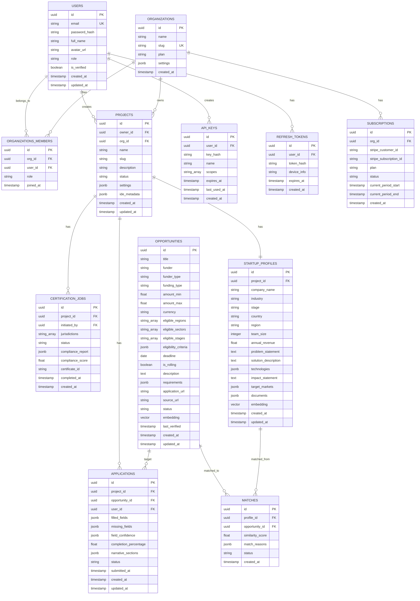

# Blueprint 07: Data Models

> **Purpose**: Complete database schemas for PostgreSQL (pgvector), MongoDB, and Redis.  
> **Rule**: These are canonical schemas. All services MUST use these exact table/collection definitions.

---

## 1. PostgreSQL Schemas

### 1.1 Entity Relationship Diagram



---

### 1.2 Complete SQL Migration

```sql
-- 001_initial_schema.sql

-- Enable extensions
CREATE EXTENSION IF NOT EXISTS "uuid-ossp";
CREATE EXTENSION IF NOT EXISTS "vector";
CREATE EXTENSION IF NOT EXISTS "pg_trgm";  -- For fuzzy text search

-- ============================================
-- ENUM TYPES
-- ============================================

CREATE TYPE user_role AS ENUM ('user', 'admin', 'superadmin');
CREATE TYPE org_member_role AS ENUM ('owner', 'admin', 'member', 'viewer');
CREATE TYPE org_plan AS ENUM ('free', 'starter', 'pro', 'enterprise');
CREATE TYPE project_status AS ENUM ('draft', 'active', 'archived', 'deleted');
CREATE TYPE startup_stage AS ENUM ('idea', 'mvp', 'seed', 'early', 'growth', 'scale');
CREATE TYPE funder_type AS ENUM ('government', 'foundation', 'corporate', 'multilateral', 'development_bank', 'ngo');
CREATE TYPE funding_type AS ENUM ('grant', 'procurement', 'tax_credit', 'subsidy', 'prize', 'loan_guarantee', 'equity_free');
CREATE TYPE opportunity_status AS ENUM ('active', 'expired', 'upcoming', 'paused');
CREATE TYPE match_status AS ENUM ('new', 'saved', 'applied', 'dismissed');
CREATE TYPE application_status AS ENUM ('draft', 'in_progress', 'review', 'submitted', 'accepted', 'rejected', 'withdrawn');
CREATE TYPE certification_status AS ENUM ('pending', 'running', 'passed', 'failed', 'conditional', 'expired');
CREATE TYPE subscription_status AS ENUM ('active', 'past_due', 'canceled', 'incomplete');

-- ============================================
-- TABLES
-- ============================================

-- Users
CREATE TABLE users (
    id UUID PRIMARY KEY DEFAULT uuid_generate_v4(),
    email VARCHAR(255) NOT NULL UNIQUE,
    password_hash VARCHAR(255),          -- NULL for OAuth-only users
    full_name VARCHAR(255) NOT NULL,
    avatar_url VARCHAR(2000),
    role user_role NOT NULL DEFAULT 'user',
    is_verified BOOLEAN NOT NULL DEFAULT FALSE,
    is_active BOOLEAN NOT NULL DEFAULT TRUE,
    last_login_at TIMESTAMPTZ,
    created_at TIMESTAMPTZ NOT NULL DEFAULT NOW(),
    updated_at TIMESTAMPTZ NOT NULL DEFAULT NOW()
);

CREATE INDEX ix_users_email ON users(email);
CREATE INDEX ix_users_created_at ON users(created_at);

-- Organizations
CREATE TABLE organizations (
    id UUID PRIMARY KEY DEFAULT uuid_generate_v4(),
    name VARCHAR(255) NOT NULL,
    slug VARCHAR(255) NOT NULL UNIQUE,
    plan org_plan NOT NULL DEFAULT 'free',
    settings JSONB NOT NULL DEFAULT '{}',
    logo_url VARCHAR(2000),
    created_at TIMESTAMPTZ NOT NULL DEFAULT NOW(),
    updated_at TIMESTAMPTZ NOT NULL DEFAULT NOW()
);

CREATE INDEX ix_orgs_slug ON organizations(slug);

-- Organization Members
CREATE TABLE organization_members (
    id UUID PRIMARY KEY DEFAULT uuid_generate_v4(),
    organization_id UUID NOT NULL REFERENCES organizations(id) ON DELETE CASCADE,
    user_id UUID NOT NULL REFERENCES users(id) ON DELETE CASCADE,
    role org_member_role NOT NULL DEFAULT 'member',
    joined_at TIMESTAMPTZ NOT NULL DEFAULT NOW(),
    UNIQUE(organization_id, user_id)
);

CREATE INDEX ix_org_members_org ON organization_members(organization_id);
CREATE INDEX ix_org_members_user ON organization_members(user_id);

-- Projects
CREATE TABLE projects (
    id UUID PRIMARY KEY DEFAULT uuid_generate_v4(),
    owner_id UUID NOT NULL REFERENCES users(id) ON DELETE CASCADE,
    organization_id UUID REFERENCES organizations(id) ON DELETE SET NULL,
    name VARCHAR(255) NOT NULL,
    slug VARCHAR(255) NOT NULL,
    description TEXT,
    status project_status NOT NULL DEFAULT 'draft',
    settings JSONB NOT NULL DEFAULT '{}',
    ide_metadata JSONB NOT NULL DEFAULT '{}',    -- IDE session data summary
    created_at TIMESTAMPTZ NOT NULL DEFAULT NOW(),
    updated_at TIMESTAMPTZ NOT NULL DEFAULT NOW(),
    UNIQUE(organization_id, slug)
);

CREATE INDEX ix_projects_owner ON projects(owner_id);
CREATE INDEX ix_projects_org ON projects(organization_id);
CREATE INDEX ix_projects_status ON projects(status);

-- Startup Profiles
CREATE TABLE startup_profiles (
    id UUID PRIMARY KEY DEFAULT uuid_generate_v4(),
    project_id UUID NOT NULL UNIQUE REFERENCES projects(id) ON DELETE CASCADE,
    company_name VARCHAR(255) NOT NULL,
    legal_name VARCHAR(255),
    industry VARCHAR(100) NOT NULL,
    stage startup_stage NOT NULL DEFAULT 'idea',
    country VARCHAR(100) NOT NULL,
    region VARCHAR(100),
    address TEXT,
    website VARCHAR(2000),
    team_size INTEGER DEFAULT 1,
    annual_revenue DECIMAL(15, 2) DEFAULT 0,
    annual_revenue_currency VARCHAR(3) DEFAULT 'USD',
    founded_year INTEGER,
    problem_statement TEXT NOT NULL,
    solution_description TEXT NOT NULL,
    technologies JSONB NOT NULL DEFAULT '[]',
    impact_statement TEXT,
    target_markets JSONB NOT NULL DEFAULT '[]',
    sdg_goals JSONB NOT NULL DEFAULT '[]',
    revenue_model TEXT,
    customer_count INTEGER DEFAULT 0,
    jobs_created INTEGER DEFAULT 0,
    previous_funding JSONB NOT NULL DEFAULT '[]',
    documents JSONB NOT NULL DEFAULT '{}',       -- {doc_type: storage_url}
    embedding VECTOR(768),                       -- Startup profile embedding
    created_at TIMESTAMPTZ NOT NULL DEFAULT NOW(),
    updated_at TIMESTAMPTZ NOT NULL DEFAULT NOW()
);

CREATE INDEX ix_profiles_project ON startup_profiles(project_id);
CREATE INDEX ix_profiles_country ON startup_profiles(country);
CREATE INDEX ix_profiles_industry ON startup_profiles(industry);
CREATE INDEX ix_profiles_embedding ON startup_profiles 
    USING hnsw (embedding vector_cosine_ops)
    WITH (m = 16, ef_construction = 64);

-- Opportunities
CREATE TABLE opportunities (
    id UUID PRIMARY KEY DEFAULT uuid_generate_v4(),
    title VARCHAR(500) NOT NULL,
    funder VARCHAR(300) NOT NULL,
    funder_type funder_type,
    funding_type funding_type NOT NULL,
    amount_min DECIMAL(15, 2),
    amount_max DECIMAL(15, 2),
    currency VARCHAR(3) DEFAULT 'USD',
    eligible_regions TEXT[] NOT NULL DEFAULT '{}',
    eligible_sectors TEXT[] NOT NULL DEFAULT '{}',
    eligible_stages TEXT[] NOT NULL DEFAULT '{}',
    eligibility_criteria JSONB NOT NULL DEFAULT '{}',
    deadline DATE,
    is_rolling BOOLEAN NOT NULL DEFAULT FALSE,
    cycle VARCHAR(50),
    description TEXT NOT NULL,
    requirements JSONB NOT NULL DEFAULT '{}',
    application_url VARCHAR(2000),
    source_url VARCHAR(2000) NOT NULL,
    status opportunity_status NOT NULL DEFAULT 'active',
    last_verified TIMESTAMPTZ,
    embedding VECTOR(768),                        -- Opportunity embedding
    created_at TIMESTAMPTZ NOT NULL DEFAULT NOW(),
    updated_at TIMESTAMPTZ NOT NULL DEFAULT NOW()
);

CREATE INDEX ix_opp_status ON opportunities(status);
CREATE INDEX ix_opp_deadline ON opportunities(deadline);
CREATE INDEX ix_opp_funding_type ON opportunities(funding_type);
CREATE INDEX ix_opp_funder_type ON opportunities(funder_type);
CREATE INDEX ix_opp_regions ON opportunities USING gin(eligible_regions);
CREATE INDEX ix_opp_sectors ON opportunities USING gin(eligible_sectors);
CREATE INDEX ix_opp_embedding ON opportunities 
    USING hnsw (embedding vector_cosine_ops)
    WITH (m = 16, ef_construction = 64);

-- Matches
CREATE TABLE matches (
    id UUID PRIMARY KEY DEFAULT uuid_generate_v4(),
    profile_id UUID NOT NULL REFERENCES startup_profiles(id) ON DELETE CASCADE,
    opportunity_id UUID NOT NULL REFERENCES opportunities(id) ON DELETE CASCADE,
    similarity_score DECIMAL(5, 4) NOT NULL,      -- 0.0000 - 1.0000
    match_reasons JSONB NOT NULL DEFAULT '[]',
    status match_status NOT NULL DEFAULT 'new',
    created_at TIMESTAMPTZ NOT NULL DEFAULT NOW(),
    UNIQUE(profile_id, opportunity_id)
);

CREATE INDEX ix_matches_profile ON matches(profile_id);
CREATE INDEX ix_matches_opportunity ON matches(opportunity_id);
CREATE INDEX ix_matches_score ON matches(similarity_score DESC);

-- Applications
CREATE TABLE applications (
    id UUID PRIMARY KEY DEFAULT uuid_generate_v4(),
    project_id UUID NOT NULL REFERENCES projects(id) ON DELETE CASCADE,
    opportunity_id UUID NOT NULL REFERENCES opportunities(id),
    user_id UUID NOT NULL REFERENCES users(id),
    filled_fields JSONB NOT NULL DEFAULT '{}',
    missing_fields JSONB NOT NULL DEFAULT '[]',
    field_confidence JSONB NOT NULL DEFAULT '{}',
    completion_percentage DECIMAL(5, 2) NOT NULL DEFAULT 0,
    narrative_sections JSONB NOT NULL DEFAULT '{}',
    quality_scores JSONB NOT NULL DEFAULT '{}',
    status application_status NOT NULL DEFAULT 'draft',
    submitted_at TIMESTAMPTZ,
    created_at TIMESTAMPTZ NOT NULL DEFAULT NOW(),
    updated_at TIMESTAMPTZ NOT NULL DEFAULT NOW()
);

CREATE INDEX ix_apps_project ON applications(project_id);
CREATE INDEX ix_apps_opportunity ON applications(opportunity_id);
CREATE INDEX ix_apps_user ON applications(user_id);
CREATE INDEX ix_apps_status ON applications(status);

-- Certification Jobs
CREATE TABLE certification_jobs (
    id UUID PRIMARY KEY DEFAULT uuid_generate_v4(),
    project_id UUID NOT NULL REFERENCES projects(id) ON DELETE CASCADE,
    initiated_by UUID NOT NULL REFERENCES users(id),
    jurisdictions TEXT[] NOT NULL,
    status certification_status NOT NULL DEFAULT 'pending',
    compliance_report JSONB,
    compliance_score DECIMAL(5, 2),
    certificate_id VARCHAR(100),
    certificate_url VARCHAR(2000),
    ip_report JSONB,
    originality_score DECIMAL(5, 2),
    completed_at TIMESTAMPTZ,
    expires_at TIMESTAMPTZ,
    created_at TIMESTAMPTZ NOT NULL DEFAULT NOW()
);

CREATE INDEX ix_cert_project ON certification_jobs(project_id);
CREATE INDEX ix_cert_status ON certification_jobs(status);

-- Subscriptions
CREATE TABLE subscriptions (
    id UUID PRIMARY KEY DEFAULT uuid_generate_v4(),
    organization_id UUID NOT NULL REFERENCES organizations(id) ON DELETE CASCADE,
    stripe_customer_id VARCHAR(255) NOT NULL,
    stripe_subscription_id VARCHAR(255) UNIQUE,
    plan org_plan NOT NULL DEFAULT 'free',
    status subscription_status NOT NULL DEFAULT 'active',
    current_period_start TIMESTAMPTZ,
    current_period_end TIMESTAMPTZ,
    created_at TIMESTAMPTZ NOT NULL DEFAULT NOW(),
    updated_at TIMESTAMPTZ NOT NULL DEFAULT NOW()
);

-- API Keys
CREATE TABLE api_keys (
    id UUID PRIMARY KEY DEFAULT uuid_generate_v4(),
    user_id UUID NOT NULL REFERENCES users(id) ON DELETE CASCADE,
    key_hash VARCHAR(255) NOT NULL UNIQUE,       -- SHA-256 of the key
    key_prefix VARCHAR(8) NOT NULL,              -- First 8 chars for identification
    name VARCHAR(100) NOT NULL,
    scopes TEXT[] NOT NULL DEFAULT '{}',
    is_active BOOLEAN NOT NULL DEFAULT TRUE,
    expires_at TIMESTAMPTZ,
    last_used_at TIMESTAMPTZ,
    created_at TIMESTAMPTZ NOT NULL DEFAULT NOW()
);

-- Refresh Tokens
CREATE TABLE refresh_tokens (
    id UUID PRIMARY KEY DEFAULT uuid_generate_v4(),
    user_id UUID NOT NULL REFERENCES users(id) ON DELETE CASCADE,
    token_hash VARCHAR(255) NOT NULL UNIQUE,
    device_info VARCHAR(500),
    expires_at TIMESTAMPTZ NOT NULL,
    created_at TIMESTAMPTZ NOT NULL DEFAULT NOW()
);

CREATE INDEX ix_refresh_user ON refresh_tokens(user_id);
CREATE INDEX ix_refresh_expires ON refresh_tokens(expires_at);

-- ============================================
-- TRIGGERS
-- ============================================

-- Auto-update updated_at
CREATE OR REPLACE FUNCTION update_updated_at()
RETURNS TRIGGER AS $$
BEGIN
    NEW.updated_at = NOW();
    RETURN NEW;
END;
$$ LANGUAGE plpgsql;

CREATE TRIGGER trg_users_updated BEFORE UPDATE ON users
    FOR EACH ROW EXECUTE FUNCTION update_updated_at();

CREATE TRIGGER trg_projects_updated BEFORE UPDATE ON projects
    FOR EACH ROW EXECUTE FUNCTION update_updated_at();

CREATE TRIGGER trg_profiles_updated BEFORE UPDATE ON startup_profiles
    FOR EACH ROW EXECUTE FUNCTION update_updated_at();

CREATE TRIGGER trg_opportunities_updated BEFORE UPDATE ON opportunities
    FOR EACH ROW EXECUTE FUNCTION update_updated_at();

CREATE TRIGGER trg_applications_updated BEFORE UPDATE ON applications
    FOR EACH ROW EXECUTE FUNCTION update_updated_at();
```

---

## 2. MongoDB Collections

### 2.1 Code Artifacts

```javascript
// Collection: code_artifacts
// Purpose: Store generated codebases with version history
{
  _id: ObjectId,
  project_id: "uuid-string",           // References PostgreSQL projects.id
  session_id: "uuid-string",           // Generation session
  version: 1,                          // Incremental version number
  
  // File tree snapshot
  files: [
    {
      path: "src/components/Button.tsx",
      content: "import React from 'react'...",
      language: "typescript",
      size_bytes: 1024,
      hash: "sha256-hash",
      created_by: "codegen_agent",     // Agent that created this file
      created_at: ISODate("2026-08-23T00:00:00Z"),
    },
    // ... all project files
  ],
  
  // Generation metadata
  generation: {
    concept: { /* original concept payload */ },
    architecture: { /* architecture blueprint */ },
    agent_history: [ /* agent actions log */ ],
    total_files: 42,
    total_lines: 3500,
    languages: { "typescript": 2100, "python": 1200, "yaml": 200 },
    duration_ms: 45000,
  },
  
  created_at: ISODate("2026-08-23T00:00:00Z"),
  updated_at: ISODate("2026-08-23T00:00:00Z"),
  
  // TTL: auto-delete draft artifacts after 30 days
  expires_at: ISODate("2026-09-22T00:00:00Z"),
}

// Indexes
db.code_artifacts.createIndex({ project_id: 1, version: -1 });
db.code_artifacts.createIndex({ session_id: 1 });
db.code_artifacts.createIndex({ expires_at: 1 }, { expireAfterSeconds: 0 });

// Validation schema
db.createCollection("code_artifacts", {
  validator: {
    $jsonSchema: {
      bsonType: "object",
      required: ["project_id", "version", "files"],
      properties: {
        project_id: { bsonType: "string" },
        version: { bsonType: "int", minimum: 1 },
        files: {
          bsonType: "array",
          items: {
            bsonType: "object",
            required: ["path", "content", "language"],
          },
        },
      },
    },
  },
});
```

### 2.2 Audit Logs

```javascript
// Collection: audit_logs
// Purpose: Immutable, hash-chained audit trail
{
  _id: ObjectId,
  project_id: "uuid-string",
  sequence: 0,                          // Sequential counter per project
  timestamp: ISODate("2026-08-23T00:00:00Z"),
  
  // Actor
  actor: "user-uuid",                   // user_id or "system"
  actor_type: "user",                   // "user" | "system" | "agent"
  
  // Action
  action: "certification_initiated",
  resource_type: "certification_job",
  resource_id: "uuid-string",
  
  // State hashes
  before_state_hash: "sha256-of-before-state",
  after_state_hash: "sha256-of-after-state",
  
  // Hash chain
  previous_hash: "GENESIS",             // Hash of previous entry (or "GENESIS")
  entry_hash: "sha256-of-this-entry",   // Hash of this entry's data
  
  // Additional context
  metadata: {
    jurisdictions: ["nigeria", "kenya"],
    ip_address: "192.168.1.1",
    user_agent: "Mozilla/5.0...",
  },
}

// Indexes
db.audit_logs.createIndex({ project_id: 1, sequence: 1 }, { unique: true });
db.audit_logs.createIndex({ timestamp: -1 });
db.audit_logs.createIndex({ action: 1 });
db.audit_logs.createIndex({ actor: 1 });

// CRITICAL: Make collection append-only
// No updates or deletes allowed (enforced at application level)
```

### 2.3 Agent Conversations

```javascript
// Collection: agent_conversations
// Purpose: Store agent interaction history for debugging and improvement
{
  _id: ObjectId,
  project_id: "uuid-string",
  session_id: "uuid-string",
  
  messages: [
    {
      role: "user",
      content: "Build a marketplace for African artisans",
      timestamp: ISODate("2026-08-23T00:00:00Z"),
    },
    {
      role: "architect_agent",
      content: "...",
      tool_calls: [
        { name: "analyze_concept", args: {}, result: {} },
      ],
      thinking: "...",
      tokens_used: { input: 1500, output: 3000 },
      duration_ms: 8000,
      timestamp: ISODate("2026-08-23T00:00:05Z"),
    },
    // ... full conversation
  ],
  
  summary: {
    total_messages: 12,
    total_tokens: { input: 15000, output: 25000 },
    total_duration_ms: 45000,
    agents_used: ["architect", "codegen", "reviewer"],
  },
  
  created_at: ISODate("2026-08-23T00:00:00Z"),
}

// Indexes
db.agent_conversations.createIndex({ project_id: 1, session_id: 1 });
db.agent_conversations.createIndex({ created_at: -1 });
```

---

## 3. Redis Data Patterns

```
# ============================================
# Redis Key Patterns
# ============================================

# --- Session Management ---
session:{session_id}                    # JSON: user session data, TTL: 30min
user:sessions:{user_id}                 # SET: active session IDs for user

# --- Rate Limiting ---
ratelimit:{endpoint}:{client_ip}        # INT: request count, TTL: 60s
ratelimit:auth:{client_ip}              # INT: auth attempt count, TTL: 300s

# --- Cache ---
cache:user:{user_id}                    # JSON: user profile, TTL: 15min
cache:project:{project_id}             # JSON: project metadata, TTL: 10min
cache:opportunities:count               # INT: total active opportunities, TTL: 1h
cache:opportunities:stats               # JSON: aggregate stats, TTL: 1h

# --- Real-time (Pub/Sub) ---
ws:session:{session_id}                # Channel: WebSocket events for session
ws:project:{project_id}               # Channel: Project-wide events

# --- Job Queue (Celery) ---
celery                                  # Default Celery broker queue
celery:results:{task_id}               # Task results, TTL: 24h

# --- IDE State ---
ide:vfs:{project_id}:{session_id}      # JSON: Virtual file system snapshot, TTL: 4h
ide:cursor:{project_id}:{user_id}      # JSON: Cursor position, TTL: 30min

# --- Generation Locks ---
lock:generation:{project_id}            # String: session_id, TTL: 600s (prevent concurrent generation)
lock:certification:{project_id}         # String: job_id, TTL: 300s
```

---

> **Next Blueprint**: [`08-API-CONTRACTS.md`](./08-API-CONTRACTS.md)
