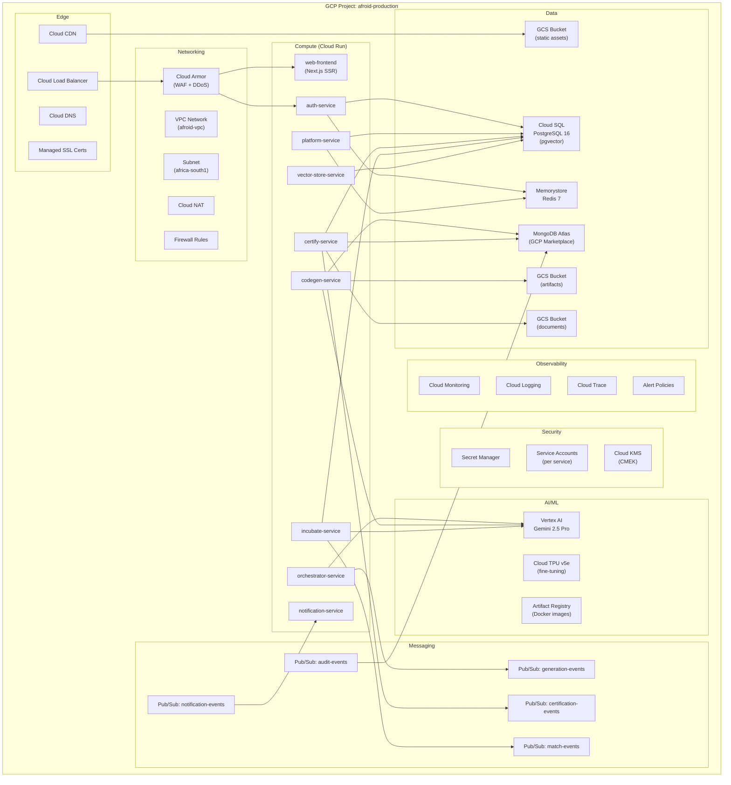

# Blueprint 09: Infrastructure — Google Cloud Platform

> **Purpose**: Complete GCP infrastructure specification with Terraform module definitions, Cloud Run configs, and resource topology.  
> **Rule**: All infrastructure is defined as Terraform code. NO manual ClickOps.

---

## 1. GCP Resource Topology



---

## 2. GCP Project Structure

| Project | Environment | Purpose |
|---------|-------------|---------|
| `afroid-dev` | Development | Dev testing, lower-tier resources |
| `afroid-staging` | Staging | Pre-production validation |
| `afroid-production` | Production | Live workloads, `africa-south1` |
| `afroid-ml` | ML/Training | TPU training, model experiments |

---

## 3. Terraform Module Structure

```
infra/terraform/
├── modules/
│   ├── networking/
│   │   ├── main.tf              # VPC, subnets, NAT, firewall
│   │   ├── variables.tf
│   │   └── outputs.tf
│   │
│   ├── cloud-run/
│   │   ├── main.tf              # Generic Cloud Run service module
│   │   ├── variables.tf
│   │   └── outputs.tf
│   │
│   ├── cloud-sql/
│   │   ├── main.tf              # PostgreSQL instance + pgvector
│   │   ├── variables.tf
│   │   └── outputs.tf
│   │
│   ├── memorystore/
│   │   ├── main.tf              # Redis instance
│   │   ├── variables.tf
│   │   └── outputs.tf
│   │
│   ├── gcs/
│   │   ├── main.tf              # Storage buckets
│   │   ├── variables.tf
│   │   └── outputs.tf
│   │
│   ├── pubsub/
│   │   ├── main.tf              # Topics + subscriptions
│   │   ├── variables.tf
│   │   └── outputs.tf
│   │
│   ├── secret-manager/
│   │   ├── main.tf              # Secret storage
│   │   ├── variables.tf
│   │   └── outputs.tf
│   │
│   ├── iam/
│   │   ├── main.tf              # Service accounts + roles
│   │   ├── variables.tf
│   │   └── outputs.tf
│   │
│   ├── monitoring/
│   │   ├── main.tf              # Dashboards + alert policies
│   │   ├── variables.tf
│   │   └── outputs.tf
│   │
│   ├── cdn-lb/
│   │   ├── main.tf              # Load balancer + CDN + SSL
│   │   ├── variables.tf
│   │   └── outputs.tf
│   │
│   └── vertex-ai/
│       ├── main.tf              # Vertex AI endpoints
│       ├── variables.tf
│       └── outputs.tf
│
├── environments/
│   ├── dev/
│   │   ├── main.tf
│   │   ├── variables.tf
│   │   ├── terraform.tfvars
│   │   └── backend.tf
│   ├── staging/
│   │   └── ...
│   └── prod/
│       └── ...
```

---

## 4. Key Terraform Module Definitions

### 4.1 Cloud Run Service Module

```hcl
# modules/cloud-run/main.tf

resource "google_cloud_run_v2_service" "service" {
  name     = var.service_name
  location = var.region
  
  template {
    scaling {
      min_instance_count = var.min_instances
      max_instance_count = var.max_instances
    }
    
    containers {
      image = "${var.artifact_registry}/${var.service_name}:${var.image_tag}"
      
      resources {
        limits = {
          cpu    = var.cpu
          memory = var.memory
        }
        cpu_idle          = true
        startup_cpu_boost = true
      }
      
      # Environment variables from Secret Manager
      dynamic "env" {
        for_each = var.env_vars
        content {
          name  = env.value.name
          value = env.value.value
        }
      }
      
      dynamic "env" {
        for_each = var.secret_env_vars
        content {
          name = env.value.name
          value_source {
            secret_key_ref {
              secret  = env.value.secret_name
              version = "latest"
            }
          }
        }
      }
      
      # Cloud SQL connection
      dynamic "volume_mounts" {
        for_each = var.cloud_sql_instance != null ? [1] : []
        content {
          name       = "cloudsql"
          mount_path = "/cloudsql"
        }
      }
      
      ports {
        container_port = var.port
      }
      
      startup_probe {
        http_get {
          path = "/health"
          port = var.port
        }
        initial_delay_seconds = 5
        period_seconds        = 10
        failure_threshold     = 3
      }
      
      liveness_probe {
        http_get {
          path = "/health"
          port = var.port
        }
        period_seconds = 30
      }
    }
    
    # Cloud SQL sidecar
    dynamic "volumes" {
      for_each = var.cloud_sql_instance != null ? [1] : []
      content {
        name = "cloudsql"
        cloud_sql_instance {
          instances = [var.cloud_sql_instance]
        }
      }
    }
    
    # VPC connector for private networking
    vpc_access {
      connector = var.vpc_connector_id
      egress    = "PRIVATE_RANGES_ONLY"
    }
    
    service_account = var.service_account_email
    
    timeout = "${var.request_timeout}s"
  }
  
  traffic {
    type    = "TRAFFIC_TARGET_ALLOCATION_TYPE_LATEST"
    percent = 100
  }
}

# IAM: Allow unauthenticated access for public services (web frontend)
resource "google_cloud_run_v2_service_iam_member" "public" {
  count    = var.allow_unauthenticated ? 1 : 0
  project  = var.project_id
  location = var.region
  name     = google_cloud_run_v2_service.service.name
  role     = "roles/run.invoker"
  member   = "allUsers"
}

# Variables
variable "service_name" { type = string }
variable "region" { type = string }
variable "min_instances" { type = number; default = 0 }
variable "max_instances" { type = number; default = 10 }
variable "cpu" { type = string; default = "1" }
variable "memory" { type = string; default = "512Mi" }
variable "port" { type = number; default = 8080 }
variable "request_timeout" { type = number; default = 300 }
variable "allow_unauthenticated" { type = bool; default = false }
variable "cloud_sql_instance" { type = string; default = null }
variable "vpc_connector_id" { type = string }
variable "service_account_email" { type = string }
variable "artifact_registry" { type = string }
variable "image_tag" { type = string; default = "latest" }
variable "env_vars" { type = list(object({ name = string, value = string })); default = [] }
variable "secret_env_vars" { type = list(object({ name = string, secret_name = string })); default = [] }
variable "project_id" { type = string }
```

### 4.2 Cloud SQL Module

```hcl
# modules/cloud-sql/main.tf

resource "google_sql_database_instance" "postgres" {
  name             = "${var.project_prefix}-postgres"
  database_version = "POSTGRES_16"
  region           = var.region
  
  settings {
    tier              = var.tier  # db-custom-4-16384 for production
    availability_type = var.high_availability ? "REGIONAL" : "ZONAL"
    disk_size         = var.disk_size_gb
    disk_type         = "PD_SSD"
    disk_autoresize   = true
    
    database_flags {
      name  = "max_connections"
      value = "200"
    }
    
    database_flags {
      name  = "shared_preload_libraries"
      value = "vector"  # pgvector extension
    }
    
    database_flags {
      name  = "log_min_duration_statement"
      value = "1000"  # Log queries > 1s
    }
    
    backup_configuration {
      enabled                        = true
      start_time                     = "02:00"
      point_in_time_recovery_enabled = true
      transaction_log_retention_days = 7
      backup_retention_settings {
        retained_backups = 30
      }
    }
    
    maintenance_window {
      day          = 7  # Sunday
      hour         = 3  # 3 AM
      update_track = "stable"
    }
    
    ip_configuration {
      ipv4_enabled    = false
      private_network = var.vpc_network_id
      require_ssl     = true
    }
    
    insights_config {
      query_insights_enabled  = true
      query_plans_per_minute  = 5
      query_string_length     = 4096
      record_application_tags = true
      record_client_address   = true
    }
  }
  
  deletion_protection = var.deletion_protection
}

resource "google_sql_database" "afroid" {
  name     = "afroid"
  instance = google_sql_database_instance.postgres.name
}

resource "google_sql_user" "app" {
  name     = "afroid_app"
  instance = google_sql_database_instance.postgres.name
  password = var.db_password  # From Secret Manager
}
```

### 4.3 Service-Specific Cloud Run Configs

```hcl
# environments/prod/main.tf — Service instantiations

locals {
  region           = "africa-south1"
  artifact_registry = "${var.region}-docker.pkg.dev/${var.project_id}/afroid"
  
  services = {
    auth = {
      cpu = "1", memory = "512Mi"
      min_instances = 1, max_instances = 10
      public = false
    }
    platform = {
      cpu = "1", memory = "512Mi"
      min_instances = 1, max_instances = 10
      public = false
    }
    orchestrator = {
      cpu = "2", memory = "2Gi"
      min_instances = 1, max_instances = 20
      timeout = 600  # 10 min for code generation
      public = false
    }
    codegen = {
      cpu = "2", memory = "2Gi"
      min_instances = 0, max_instances = 20
      timeout = 600
      public = false
    }
    certify = {
      cpu = "1", memory = "1Gi"
      min_instances = 0, max_instances = 10
      public = false
    }
    incubate = {
      cpu = "2", memory = "1Gi"
      min_instances = 1, max_instances = 15
      public = false
    }
    "vector-store" = {
      cpu = "1", memory = "1Gi"
      min_instances = 1, max_instances = 10
      public = false
    }
    notification = {
      cpu = "0.5", memory = "256Mi"
      min_instances = 0, max_instances = 5
      public = false
    }
    web = {
      cpu = "1", memory = "512Mi"
      min_instances = 2, max_instances = 50
      public = true  # Frontend is public
    }
  }
}

module "cloud_run" {
  for_each = local.services
  source   = "../../modules/cloud-run"
  
  service_name          = each.key
  region                = local.region
  project_id            = var.project_id
  artifact_registry     = local.artifact_registry
  image_tag             = var.image_tag
  cpu                   = each.value.cpu
  memory                = each.value.memory
  min_instances         = each.value.min_instances
  max_instances         = each.value.max_instances
  request_timeout       = lookup(each.value, "timeout", 300)
  allow_unauthenticated = each.value.public
  cloud_sql_instance    = module.cloud_sql.connection_name
  vpc_connector_id      = module.networking.vpc_connector_id
  service_account_email = module.iam.service_accounts[each.key].email
  
  env_vars = [
    { name = "APP_ENV", value = "production" },
    { name = "GCP_PROJECT_ID", value = var.project_id },
    { name = "GCP_REGION", value = local.region },
  ]
  
  secret_env_vars = [
    { name = "DATABASE_URL", secret_name = "database-url" },
    { name = "REDIS_URL", secret_name = "redis-url" },
    { name = "JWT_SECRET_KEY", secret_name = "jwt-secret" },
  ]
}
```

---

## 5. Pub/Sub Topics & Subscriptions

```hcl
# modules/pubsub/main.tf

locals {
  topics = {
    "generation-events" = {
      subscriptions = ["orchestrator-sub", "audit-sub"]
    }
    "certification-events" = {
      subscriptions = ["certify-sub", "audit-sub", "notification-sub"]
    }
    "match-events" = {
      subscriptions = ["incubate-sub", "notification-sub"]
    }
    "audit-events" = {
      subscriptions = ["audit-logger-sub"]
    }
    "notification-events" = {
      subscriptions = ["email-sub", "push-sub"]
    }
  }
}

resource "google_pubsub_topic" "topics" {
  for_each = local.topics
  name     = each.key
  
  message_retention_duration = "86400s"  # 24 hours
  
  schema_settings {
    encoding = "JSON"
  }
}

resource "google_pubsub_subscription" "subscriptions" {
  for_each = { for t, config in local.topics : t => config.subscriptions }
  # Flatten into individual subscriptions
  # ... (dynamic block for each subscription)
}
```

---

## 6. GCS Buckets

| Bucket Name | Purpose | Location | Access | Lifecycle |
|-------------|---------|----------|--------|-----------|
| `afroid-artifacts-{env}` | Generated code archives (.zip) | `africa-south1` | Private | Delete after 90 days for drafts |
| `afroid-documents-{env}` | Compliance certificates, reports | `africa-south1` | Private | Retain 7 years |
| `afroid-static-{env}` | Web static assets (JS, CSS, images) | Multi-region | Public (CDN) | Cache 30 days |
| `afroid-uploads-{env}` | User uploaded documents | `africa-south1` | Private | Delete unprocessed after 7 days |
| `afroid-ml-{env}` | ML training data, model artifacts | `us-central1` | Private | Retain indefinitely |
| `afroid-backups-{env}` | Database backups export | `africa-south1` | Private | Nearline after 30 days, Coldline after 90 |

---

## 7. Monitoring & Alerting

### Alert Policies

| Alert | Condition | Severity | Notification |
|-------|-----------|----------|--------------|
| Service Down | Cloud Run error rate > 5% for 5 min | Critical | PagerDuty + Slack |
| High Latency | P95 > 3s for 10 min | Warning | Slack |
| Database CPU | Cloud SQL CPU > 80% for 15 min | Warning | Slack |
| Database Storage | Disk usage > 80% | Critical | PagerDuty |
| Memory Pressure | Cloud Run memory > 90% | Warning | Slack |
| LLM Errors | Vertex AI error rate > 10% | Critical | Slack |
| Budget Alert | Spending > 80% of monthly budget | Warning | Email + Slack |
| SSL Expiry | Certificate expires within 14 days | Warning | Email |

### Custom Dashboard Panels

```
Dashboard: Afroid Production Overview
├── Row 1: Traffic
│   ├── Requests per second (all services)
│   ├── Error rate (4xx, 5xx)
│   └── P50/P95/P99 latency
├── Row 2: Services
│   ├── Cloud Run instance count per service
│   ├── Cloud Run CPU utilization
│   └── Cloud Run memory utilization
├── Row 3: Data
│   ├── Cloud SQL connections
│   ├── Cloud SQL CPU/memory
│   ├── Redis hit rate
│   └── Redis memory usage
├── Row 4: AI
│   ├── Vertex AI requests/sec
│   ├── LLM token usage
│   ├── LLM latency
│   └── Generation success rate
└── Row 5: Business
    ├── Active users
    ├── Projects created
    ├── Certifications completed
    └── Funding applications submitted
```

---

## 8. Cost Estimation (Production)

| Resource | Spec | Monthly Est. (USD) |
|----------|------|--------------------|
| Cloud Run (9 services) | avg 2 instances each | $800 |
| Cloud SQL PostgreSQL | db-custom-4-16384, 100GB SSD | $400 |
| Memorystore Redis | 2GB, Standard tier | $150 |
| MongoDB Atlas (M10) | 2GB RAM, 10GB storage | $100 |
| Cloud Storage | ~500GB across all buckets | $12 |
| Pub/Sub | ~10M messages/month | $40 |
| Vertex AI (Gemini) | ~50M tokens/month | $500 |
| Cloud CDN | ~100GB egress | $10 |
| Secret Manager | ~20 secrets | $1 |
| Cloud Monitoring | Included | $0 |
| Cloud Armor | Standard tier | $5 |
| Artifact Registry | ~20GB images | $2 |
| **Total** | | **~$2,020/month** |

> **Note**: Costs scale with usage. Free tier credits and Google for Startups credits significantly offset early costs.

---

> **Next Blueprint**: [`10-SECURITY-AUTH.md`](./10-SECURITY-AUTH.md)
