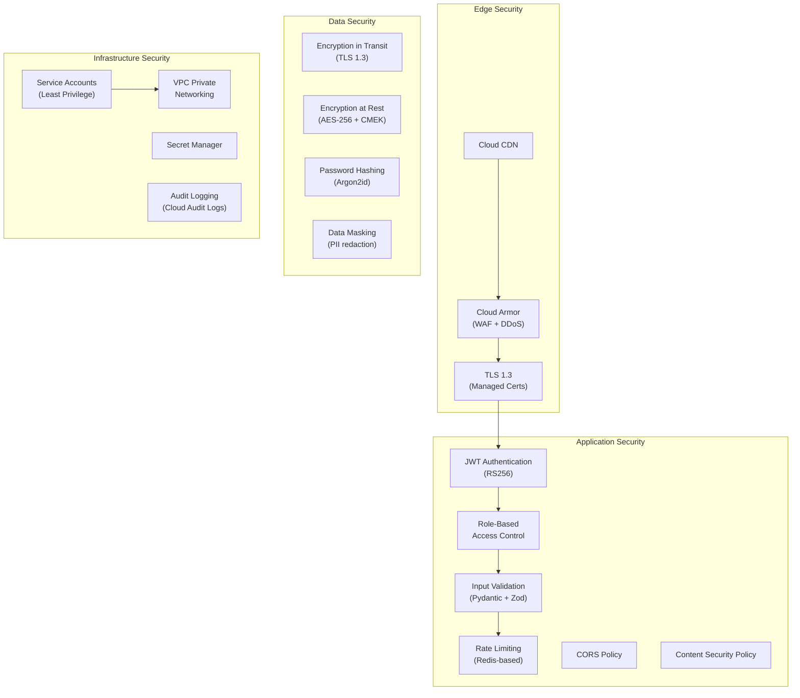
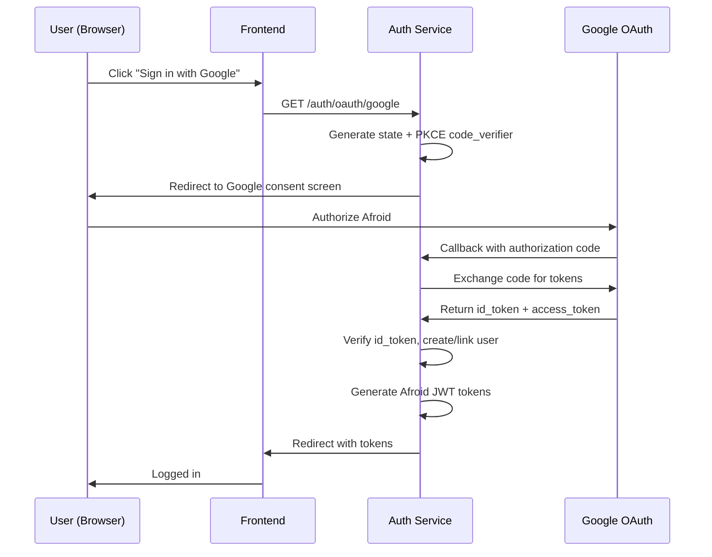

# Blueprint 10: Security & Authentication

> **Purpose**: Complete security architecture — authentication, authorization, encryption, RBAC, and threat model.  
> **Rule**: Security is non-negotiable. Every pattern here MUST be implemented.

---

## 1. Security Architecture Overview



---

## 2. Authentication System

### 2.1 JWT Token Architecture

```python
# Token structure and configuration

# Access Token (short-lived)
ACCESS_TOKEN_CONFIG = {
    "algorithm": "RS256",               # RSA asymmetric signing
    "expiry_minutes": 30,
    "issuer": "https://api.afroid.io",
    "audience": "https://api.afroid.io",
}

# Access Token Payload
{
    "sub": "user-uuid",                 # Subject (user ID)
    "email": "user@example.com",
    "role": "user",                     # Global role
    "org_roles": {                      # Organization-specific roles
        "org-uuid-1": "owner",
        "org-uuid-2": "member"
    },
    "iss": "https://api.afroid.io",
    "aud": "https://api.afroid.io",
    "iat": 1693000000,                  # Issued at
    "exp": 1693001800,                  # Expires at (30 min)
    "jti": "unique-token-id"           # Token ID (for revocation)
}

# Refresh Token (long-lived, opaque)
REFRESH_TOKEN_CONFIG = {
    "length": 64,                       # Random bytes
    "expiry_days": 30,
    "rotation": True,                   # New refresh token on each use
    "family_detection": True,           # Detect token reuse (theft indicator)
}
```

### 2.2 Key Management

```python
# RSA key pair for JWT signing
# Keys stored in Google Secret Manager, rotated every 90 days

KEY_ROTATION = {
    "rotation_period_days": 90,
    "overlap_period_days": 7,           # Both old and new keys valid
    "key_size_bits": 2048,
    "algorithm": "RS256",
}

# JWKS endpoint for token verification
# GET /.well-known/jwks.json
{
    "keys": [
        {
            "kty": "RSA",
            "kid": "key-id-2026-08",
            "use": "sig",
            "alg": "RS256",
            "n": "...",                 # Public key modulus
            "e": "AQAB"                # Public key exponent
        }
    ]
}
```

### 2.3 Password Security

```python
# Password hashing configuration
PASSWORD_CONFIG = {
    "algorithm": "argon2id",            # Memory-hard hashing
    "time_cost": 3,                     # Iterations
    "memory_cost": 65536,               # 64 MB
    "parallelism": 4,                   # Parallel threads
    "hash_length": 32,                  # Output hash length
    "salt_length": 16,                  # Random salt length
}

# Password policy
PASSWORD_POLICY = {
    "min_length": 8,
    "max_length": 128,
    "require_uppercase": True,
    "require_lowercase": True,
    "require_digit": True,
    "require_special": False,           # Encouraged but not required
    "disallow_common": True,            # Check against common password list
    "disallow_user_info": True,         # Cannot contain email/name
}
```

### 2.4 OAuth2 Flow



---

## 3. Role-Based Access Control (RBAC)

### 3.1 Role Hierarchy

```
superadmin (platform-level)
  └── admin (platform-level)
       └── user (platform-level)

Organization roles:
  owner → admin → member → viewer
```

### 3.2 Permission Matrix

| Resource | Action | superadmin | admin | owner | org_admin | member | viewer |
|----------|--------|:---:|:---:|:---:|:---:|:---:|:---:|
| **Users** | Create | ✓ | ✓ | - | - | - | - |
| | Read (any) | ✓ | ✓ | - | - | - | - |
| | Read (self) | ✓ | ✓ | ✓ | ✓ | ✓ | ✓ |
| | Update (self) | ✓ | ✓ | ✓ | ✓ | ✓ | ✓ |
| | Delete | ✓ | - | - | - | - | - |
| **Organizations** | Create | ✓ | ✓ | ✓ | - | - | - |
| | Read | ✓ | ✓ | ✓ | ✓ | ✓ | ✓ |
| | Update | ✓ | ✓ | ✓ | ✓ | - | - |
| | Delete | ✓ | - | ✓ | - | - | - |
| | Manage Members | ✓ | ✓ | ✓ | ✓ | - | - |
| **Projects** | Create | ✓ | ✓ | ✓ | ✓ | ✓ | - |
| | Read | ✓ | ✓ | ✓ | ✓ | ✓ | ✓ |
| | Update | ✓ | ✓ | ✓ | ✓ | ✓ | - |
| | Delete | ✓ | ✓ | ✓ | ✓ | - | - |
| | Generate Code | ✓ | ✓ | ✓ | ✓ | ✓ | - |
| **Certify** | Initiate | ✓ | ✓ | ✓ | ✓ | ✓ | - |
| | View Reports | ✓ | ✓ | ✓ | ✓ | ✓ | ✓ |
| | Download Certs | ✓ | ✓ | ✓ | ✓ | ✓ | ✓ |
| **Incubate** | View Opportunities | ✓ | ✓ | ✓ | ✓ | ✓ | ✓ |
| | Run Matching | ✓ | ✓ | ✓ | ✓ | ✓ | - |
| | Create Application | ✓ | ✓ | ✓ | ✓ | ✓ | - |
| | Submit Application | ✓ | ✓ | ✓ | ✓ | ✓ | - |
| **Billing** | View | ✓ | ✓ | ✓ | ✓ | - | - |
| | Manage | ✓ | ✓ | ✓ | - | - | - |

### 3.3 Authorization Middleware

```python
# services/shared/auth.py
from functools import wraps
from fastapi import Depends, HTTPException, status

class Permission:
    """Define a permission check."""
    def __init__(self, resource: str, action: str):
        self.resource = resource
        self.action = action


def require_permission(resource: str, action: str):
    """FastAPI dependency for permission checking."""
    async def check_permission(
        current_user: User = Depends(get_current_user),
        resource_id: str | None = None,
    ):
        # Check platform-level role
        if current_user.role == "superadmin":
            return current_user
        
        # Check resource-specific permissions
        if not has_permission(current_user, resource, action, resource_id):
            raise HTTPException(
                status_code=status.HTTP_403_FORBIDDEN,
                detail=f"Insufficient permissions: {resource}:{action}"
            )
        
        return current_user
    
    return Depends(check_permission)


def has_permission(user: User, resource: str, action: str, resource_id: str = None) -> bool:
    """Check if user has permission for resource:action."""
    # Implementation checks PERMISSION_MATRIX against user's role
    # and organization membership
    ...
```

---

## 4. Data Encryption

### 4.1 Encryption Strategy

| Data State | Method | Key Management |
|-----------|--------|----------------|
| **In Transit** | TLS 1.3 (mandatory) | Google-managed SSL certs |
| **At Rest (DB)** | AES-256 (Cloud SQL default) | Google-managed |
| **At Rest (GCS)** | AES-256-GCM | CMEK via Cloud KMS |
| **At Rest (Secrets)** | AES-256 | Secret Manager |
| **Sensitive Fields** | Application-level AES-256-GCM | App-managed key in Secret Manager |
| **Passwords** | Argon2id one-way hash | N/A (irreversible) |
| **API Keys** | SHA-256 one-way hash | N/A (irreversible) |

### 4.2 Sensitive Field Encryption

```python
# Fields that require application-level encryption
ENCRYPTED_FIELDS = {
    "users": ["phone_number"],
    "startup_profiles": ["tax_id", "bank_account"],
    "applications": ["financial_data"],
}

# Encryption helper
from cryptography.fernet import Fernet

class FieldEncryptor:
    def __init__(self, key: bytes):
        self.fernet = Fernet(key)
    
    def encrypt(self, plaintext: str) -> str:
        return self.fernet.encrypt(plaintext.encode()).decode()
    
    def decrypt(self, ciphertext: str) -> str:
        return self.fernet.decrypt(ciphertext.encode()).decode()
```

---

## 5. Input Validation & Sanitization

### 5.1 Backend Validation (Pydantic)

```python
# Every API endpoint uses Pydantic v2 for request validation
from pydantic import BaseModel, Field, EmailStr, field_validator
import bleach

class RegisterRequest(BaseModel):
    email: EmailStr
    password: str = Field(..., min_length=8, max_length=128)
    full_name: str = Field(..., min_length=2, max_length=255)
    
    @field_validator('full_name')
    @classmethod
    def sanitize_name(cls, v: str) -> str:
        # Strip HTML tags, normalize whitespace
        return bleach.clean(v.strip())
    
    @field_validator('password')
    @classmethod
    def validate_password(cls, v: str) -> str:
        if not any(c.isupper() for c in v):
            raise ValueError('Password must contain an uppercase letter')
        if not any(c.isdigit() for c in v):
            raise ValueError('Password must contain a digit')
        return v
```

### 5.2 Frontend Validation (Zod)

```typescript
// Every form uses Zod for client-side validation
import { z } from 'zod';

export const registerSchema = z.object({
  email: z.string().email('Invalid email address'),
  password: z
    .string()
    .min(8, 'Password must be at least 8 characters')
    .regex(/[A-Z]/, 'Must contain an uppercase letter')
    .regex(/\d/, 'Must contain a digit'),
  fullName: z
    .string()
    .min(2, 'Name must be at least 2 characters')
    .max(255),
});
```

---

## 6. Security Headers

```python
# Middleware: SecurityHeadersMiddleware
SECURITY_HEADERS = {
    "X-Content-Type-Options": "nosniff",
    "X-Frame-Options": "DENY",
    "X-XSS-Protection": "0",  # Deprecated, CSP handles this
    "Strict-Transport-Security": "max-age=31536000; includeSubDomains; preload",
    "Content-Security-Policy": (
        "default-src 'self'; "
        "script-src 'self' 'unsafe-inline' https://apis.google.com; "
        "style-src 'self' 'unsafe-inline' https://fonts.googleapis.com; "
        "font-src 'self' https://fonts.gstatic.com; "
        "img-src 'self' data: https:; "
        "connect-src 'self' https://api.afroid.io wss://api.afroid.io; "
        "frame-ancestors 'none';"
    ),
    "Referrer-Policy": "strict-origin-when-cross-origin",
    "Permissions-Policy": "camera=(), microphone=(), geolocation=()",
    "Cross-Origin-Opener-Policy": "same-origin",
    "Cross-Origin-Resource-Policy": "same-origin",
}
```

---

## 7. Rate Limiting

```python
# Redis-based sliding window rate limiter
import redis.asyncio as redis
from fastapi import Request, HTTPException

class RateLimiter:
    def __init__(self, redis_client: redis.Redis):
        self.redis = redis_client
    
    async def check(
        self, 
        key: str, 
        max_requests: int, 
        window_seconds: int,
    ) -> tuple[bool, dict]:
        """Sliding window rate limiter."""
        now = time.time()
        window_start = now - window_seconds
        pipe = self.redis.pipeline()
        
        # Remove old entries
        pipe.zremrangebyscore(key, 0, window_start)
        # Add current request
        pipe.zadd(key, {str(now): now})
        # Count requests in window
        pipe.zcard(key)
        # Set TTL
        pipe.expire(key, window_seconds)
        
        _, _, count, _ = await pipe.execute()
        
        headers = {
            "X-RateLimit-Limit": str(max_requests),
            "X-RateLimit-Remaining": str(max(0, max_requests - count)),
            "X-RateLimit-Reset": str(int(now + window_seconds)),
        }
        
        return count <= max_requests, headers


# Endpoint-specific limits
RATE_LIMITS = {
    "/v1/auth/login":       {"max": 10,  "window": 60},    # 10/min
    "/v1/auth/register":    {"max": 5,   "window": 60},    # 5/min
    "/v1/orchestrate":      {"max": 5,   "window": 3600},  # 5/hour
    "/v1/incubate/writer":  {"max": 20,  "window": 3600},  # 20/hour
    "/v1/incubate/ocr":     {"max": 30,  "window": 3600},  # 30/hour
    "default":              {"max": 100, "window": 60},     # 100/min
}
```

---

## 8. Service Account Security (Least Privilege)

| Service | Service Account | Roles |
|---------|----------------|-------|
| auth-service | `auth-sa@...` | `cloudsql.client`, `secretmanager.secretAccessor` |
| platform-service | `platform-sa@...` | `cloudsql.client`, `secretmanager.secretAccessor` |
| orchestrator-service | `orchestrator-sa@...` | `aiplatform.user`, `pubsub.publisher` |
| codegen-service | `codegen-sa@...` | `aiplatform.user`, `storage.objectCreator` |
| certify-service | `certify-sa@...` | `cloudsql.client`, `storage.objectAdmin` |
| incubate-service | `incubate-sa@...` | `cloudsql.client`, `aiplatform.user`, `vision.viewer` |
| vector-store-service | `vector-sa@...` | `cloudsql.client`, `aiplatform.user` |
| notification-service | `notif-sa@...` | `pubsub.subscriber` |
| web-frontend | `web-sa@...` | `run.invoker` (invoke backend services) |

---

## 9. Threat Model (STRIDE)

| Threat | Category | Mitigation |
|--------|----------|------------|
| Stolen JWT token | Spoofing | Short expiry (30 min), token rotation, IP binding |
| SQL injection | Tampering | Parameterized queries (SQLAlchemy), input validation |
| XSS in generated code | Tampering | CSP headers, output encoding, sanitization |
| Prompt injection via concept input | Tampering | Input sanitization, output validation, sandboxed execution |
| Unauthorized data access | Info Disclosure | RBAC, field-level encryption, query scoping |
| Brute force login | Info Disclosure | Rate limiting, account lockout after 10 failures |
| DDoS | Denial of Service | Cloud Armor WAF, rate limiting, auto-scaling |
| Token replay | Elevation of Privilege | JTI claim, token blacklist on logout |
| Service impersonation | Spoofing | Service accounts, mTLS between services |
| Data exfiltration | Info Disclosure | VPC private networking, egress firewall rules |

---

> **Next Blueprint**: [`11-CI-CD-PIPELINE.md`](./11-CI-CD-PIPELINE.md)
